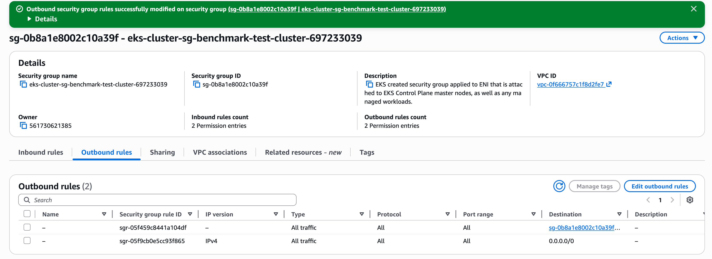

# GPU Fine-Tuning

This directory contains Kubernetes manifests for Auto Mode cluster and NodePools optimized for fine-tuning workloads.

## Prerequisites

- eksctl (use latest version; 0.196.0 or later for Auto Mode support, tested with 0.224.0)
- kubectl
- AWS CLI

## Create EKS Auto Mode Cluster

Create an EKS cluster with Auto Mode enabled using eksctl:

```bash
export CLUSTER_NAME=benchmark-test-cluster
export AWS_REGION=us-east-1
```

If you want to utilize spot instance, you should create the cluster in all available azs. Get all available AZs in your selected region:

```
export EKS_CP_AZS=$(aws ec2 describe-availability-zones \
      --region ${AWS_REGION} \
      --filters "Name=opt-in-status,Values=opt-in-not-required" \
      --query "AvailabilityZones[?ZoneId!='use1-az3'].[ZoneName]" \
      --output text | sed 's/ /, /g; s/^/  - /')
```

Create the cluster from `eksctl.yaml` configuration:

```
eksctl create cluster -f <(envsubst < eksctl.yaml)
```

To be deleted, this is a simple command that will create cluster in 2 AZs no fsx csi driver.

```bash
eksctl create cluster --name=$CLUSTER_NAME --region=$AWS_REGION --enable-auto-mode
```

This command takes a few minutes to complete. After completion, eksctl automatically updates your kubeconfig and targets your newly created cluster. To verify that the cluster is operational, use the following:

```
kubectl get pods --all-namespaces
```

Sample output:

```
NAMESPACE     NAME                                  READY   STATUS    RESTARTS   AGE
kube-system   metrics-server-6d67d68f67-7x4tg       1/1     Running   0          3m
kube-system   metrics-server-6d67d68f67-l4xv6       1/1     Running   0          3m
```

## Create Spot H100 NodePool with Default NodeClass

```
kubectl apply -f automode/cli/spot-p-nodepool.yaml
```

This command creates a dynamic Spot NodePool using the default NodeClass that starts with 0 instances and scales up only when a workload is scheduled. The NodePool is configured to scale down to 0 when idle and up to a maximum of 2 Spot p5.48xlarge instances.

Validate NodePools is created:

```
kubectl get nodepools spot-p
```

Expected output:

```
NAME        NODECLASS   NODES   READY   AGE
spot-p      default     0       True    15s
```

### Test with a Sample Pod

`nvidia-smi` (NVIDIA System Management Interface) is a standard diagnostic tool used across the industry to verify GPU availability, driver versions, and device health. Deploy a test pod requesting a single GPU to confirm that Auto Mode provisions a GPU node and the NVIDIA device plugin exposes GPUs to the container runtime

```bash
cat << EOF | kubectl apply -f -
apiVersion: v1
kind: Pod
metadata:
  name: nvidia-smi
spec:
  tolerations:
  - key: "nvidia.com/gpu"
    operator: "Exists"
    effect: "NoSchedule"
  containers:
  - name: nvidia-smi
    image: public.ecr.aws/amazonlinux/amazonlinux:2023-minimal
    command: ["nvidia-smi"]
    resources:
      limits:
        nvidia.com/gpu: 1
        vpc.amazonaws.com/efa: 32
  restartPolicy: OnFailure
EOF
```

Check if getting ICEd:

```
kubectl get events | grep InsufficientCapacityError
```

If you get:

```
3m7s        Warning   InsufficientCapacityError        nodeclaim/spot-p-d8rwv     NodeClaim spot-p-d8rwv event: creating nodeclaim, creating instance, insufficient capacity, with fleet error(s), UnfulfillableCapacity: Unable to fulfill capacity due to your request configuration. Please adjust your request and try again. (aws-error-code=UnfulfillableCapacity, aws-operation-name=CreateFleet, aws-request-id=49c1...
```

Means you are getting ICEd.
Check the pod logs:

```bash
kubectl logs nvidia-smi
```

## Install MPI Operator

MPI Operator is an open-source Kubernetes controller from Kubeflow that manages distributed MPI jobs by automating worker pod creation, SSH setup, and `mpirun` orchestration across nodes. To validate multi-instance EFA networking, we need to run a distributed NCCL test (like `all_reduce_perf`) across multiple GPU nodes, which requires MPI to coordinate the communication between workers, and the MPI Operator handles that orchestration on Kubernetes.

> [!NOTE]
> There is no official Helm chart for MPI Operator, only community-maintained (outdated) charts. Kubeflow recommends `kubectl apply`. See the [MPI Operator GitHub repo](https://github.com/kubeflow/mpi-operator) for details.

#### kubectl apply ([official instructions](https://github.com/kubeflow/mpi-operator), recommended)

Install the latest release (v0.8.0) directly from the Kubeflow repo:

```bash
kubectl apply --server-side -f https://raw.githubusercontent.com/kubeflow/mpi-operator/v0.8.0/deploy/v2beta1/mpi-operator.yaml
```

This installs the operator and the `MPIJob` CRD (`mpijobs.kubeflow.org`) used to run distributed MPI workloads on Kubernetes.

#### Verify installation

Validate `mpi` pod is Running (it might take 30-40s for the pod to be in Running state)

```bash
kubectl get pods -n mpi-operator
```

Expected output:

```
NAME                            READY   STATUS    RESTARTS   AGE
mpi-operator-85f8599757-wz2gp   1/1     Running   0          41s
```

Validate `mpi` CRD was created

```
kubectl get crd | grep mpi
```

Expected output:

```
mpijobs.kubeflow.org
```

## Run MPI Job

```
kubectl apply -f mpijob.yaml
```

```
export REGISTRY="public.ecr.aws/hpc-cloud/"
export IMAGE="efa"
export TAG=":h100"
export INSTANCE_TYPE="p5.48xlarge"
export GPU_PER_INSTANCE="8"
export GPU_TOTAL="16"
export EFA_PER_INSTANCE="32"
export LD_LIBRARY_PATH="/opt/amazon/openmpi/lib:/opt/amazon/efa/lib64:/opt/amazon/efa/lib:/opt/nvidia/nvda_nixl/lib/x86_64-linux-gnu:/opt/nvidia/nvda_nixl/lib/x86_64-linux-gnu/plugins:/usr/local/ucx/lib:/usr/local/ucx/lib/ucx:/usr/local/lib:/usr/local/cuda/compat/lib"
```

## Create On-Demand Capacity Reservation (ODCR)

To ensure GPU instance availability, create an On-Demand Capacity Reservation:

### Option 1: Using AWS Console

1. Navigate to the EC2 console → Capacity Reservations → Create capacity reservation
2. Configure the reservation with the following settings:
   - **Instance type**: `p5.48xlarge` (must match the GPU instance type used in the nodepool)
   - **Platform**: Linux/UNIX
   - **Availability Zone**: Select any available zone in your region (must match your EKS cluster subnets)
   - **Instance count**: 1 (must match the `replicas` value in nodepool.yaml)
   - **Reservation ends**: Select "Specific time" and set the date to 3 hours from now (or select "Manually" if you want to control when to end the reservation)
   - **Instance eligibility**: "Open" (allows any account with access to use the reservation)
3. Click **Create**
4. Note the Capacity Reservation ID (format: `cr-xxxxxxxxxxxxxxxxx`) for use in the setup steps below

### Option 2: Using AWS CLI

```bash
# Calculate end date (1 hours from now) - macOS compatible
END_DATE=$(date -u -v+1H +"%Y-%m-%dT%H:%M:%S.000Z")
CR_AZ="us-east-1a"
```

Create the Capacity Reservation
Note: If the command succeeds it will result in 1h charge for p5.48xl (~$55)

```
aws ec2 create-capacity-reservation \
  --instance-type p5.48xlarge \
  --instance-platform Linux/UNIX \
  --availability-zone "$CR_AZ" \
  --instance-count 1 \
  --instance-match-criteria open \
  --end-date-type limited \
  --end-date "$END_DATE"
```

Expected result, option 1:

```
An error occurred (InsufficientInstanceCapacity) when calling the CreateCapacityReservation operation (reached max retries: 2): Insufficient capacity.
```

Change the az and retry.

Note the `CapacityReservationId` from the output.

## Setup Instructions

### 1. Get and Validate Capacity Reservation ID

```bash
CAPACITY_RESERVATION_ID=$(aws ec2 describe-capacity-reservations \
  --filters "Name=state,Values=active" "Name=instance-type,Values=p5.48xlarge" \
  --query 'CapacityReservations[0].CapacityReservationId' \
  --output text)

echo "Capacity Reservation ID: $CAPACITY_RESERVATION_ID"
```

### 2. Update the `nodeclass.yaml` with the CapacityReservationId

```bash
envsubst < nodeclass.yaml
```

Validate file is updated with capacity reservation:

```
cat nodeclass.yaml | grep -A 2 "capacityReservationSelectorTerms"
```

Expected output:

```yaml
capacityReservationSelectorTerms:
  - id: cr-xxxxxxxxxxxxxxxxx
```

### 3. Apply NodeClass

```bash
kubectl apply -f nodeclass.yaml
```

### 4. Validate NodeClass Creation

```bash
kubectl get nodeclass gpu-fine-tuning-with-odcr
```

Expected output:

```
NAME                          READY
gpu-fine-tuning-with-odcr     True
```

### 5. Apply NodePool

```bash
kubectl apply -f nodepool.yaml
```

### 6. Validate NodePool Creation

```bash
kubectl get nodepool gpu-fine-tuning-static
```

Expected output:

```
NAME                      REPLICAS   NODES   READY
gpu-fine-tuning-static    1          0       True
```

Note: NODES will show 0 initially, then 1 after the node is provisioned (5-10 minutes).

### 7. Verify Node Provisioning

#### Check NodeClass Status

```bash
kubectl get nodeclass gpu-fine-tuning-with-odcr -o yaml
```

Expected output should show:

- `status.conditions` with `Ready: True`
- `status.subnets` populated with subnet IDs
- `status.securityGroups` populated with security group IDs

#### Check NodePool Status

```bash
kubectl get nodepool gpu-fine-tuning-static
```

Expected output:

```
NAME                      REPLICAS   NODES   READY
gpu-fine-tuning-static    1          1       True
```

#### Verify Node is Running

Wait for the node to be provisioned (may take 5-10 minutes):

```bash
kubectl get nodes -l workload=fine-tuning -w
```

Expected output should show 1 node with:

- Status: `Ready`
- Instance type: `p5.48xlarge`
- 8 GPUs available

#### Check Node Details

```bash
kubectl describe node -l workload=fine-tuning
```

Verify:

- ✅ Taints: `nvidia.com/gpu:NoSchedule`
- ✅ Labels: `workload=fine-tuning`, `gpu=nvidia-h100`
- ✅ Capacity: `nvidia.com/gpu: 8`
- ✅ Allocatable: `nvidia.com/gpu: 8`

### Pods not scheduling

Verify:

1. Pod has correct tolerations for `nvidia.com/gpu` taint
2. Pod has correct nodeSelector: `workload: fine-tuning`
3. Pod requests GPUs: `nvidia.com/gpu: <count>`

## Cleanup

To remove the node pool and node class:

```bash
# Delete test pod if still running
kubectl delete pod nvidia-smi

# Delete NodePool (will drain and terminate nodes)
kubectl delete nodepool gpu-fine-tuning-static

# Delete NodeClass
kubectl delete nodeclass gpu-fine-tuning-with-odcr
```



## Scaling

To change the number of static nodes:

```bash
kubectl scale nodepool gpu-fine-tuning-static --replicas=<desired-count>
```

Note: Ensure your capacity reservation has sufficient capacity for the desired replica count.

## Troubleshooting

### Node not provisioning

Check NodePool events:

```bash
kubectl describe nodepool gpu-fine-tuning-static
```

Common issues:

- Capacity reservation ID is incorrect or inactive
- Insufficient capacity in the reservation
- Security group or subnet configuration issues

### Node stuck in NotReady state

Check node conditions:

```bash
kubectl describe node -l workload=fine-tuning
```
