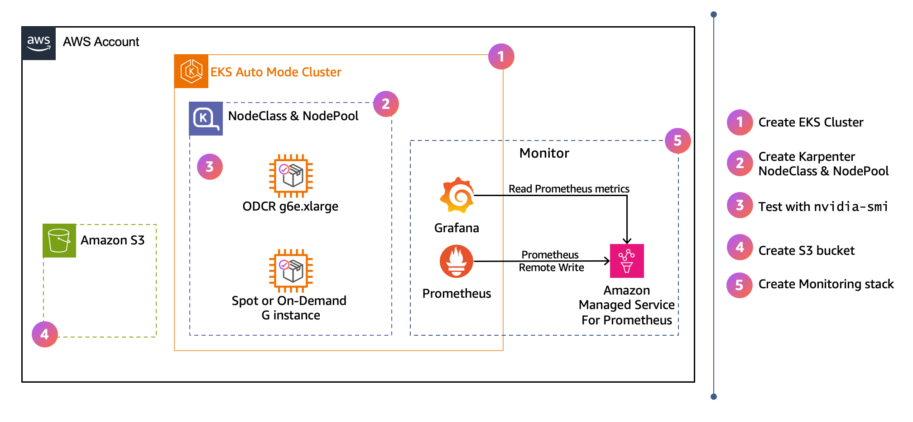

# Set Up Cluster and Nodes

This section contains instructions to create an EKS Auto Mode cluster with GPU NodePools optimized for inference workloads, as depicted in the following diagram:



_Diagram 1: EKS Auto Mode cluster with a GPU NodeClass and NodePool that launches reserved capacity first and falls back to Spot or On-Demand for overflow._

## Prerequisites

- kubectl >= 1.34
- AWS CLI >= 2.27
- Helm >= 3.14
- jq
- eksctl >= 0.225.0

Verify your eksctl version:

```bash
eksctl version
```

If you are on a version older than 0.225.0, follow the [eksctl installation guide](https://eksctl.io/installation/) to upgrade to the latest release.

## Create EKS Auto Mode Cluster

Create an EKS cluster with Auto Mode enabled using eksctl:

```bash
# NOTE: Keep this cluster name value consistent throughout the guide. Changing
# it may cause subsequent commands to target the wrong cluster.
export CLUSTER_NAME=eks-docs-inf
export AWS_REGION=us-east-2
```

By default, eksctl creates a cluster in 2 AZs. Using all available AZs improves fault tolerance and increases the chances of obtaining GPU capacity. Check the available AZs in your region:

```bash
export AZS=$(aws ec2 describe-availability-zones \
  --region ${AWS_REGION} \
  --query "AvailabilityZones[?ZoneId!='use1-az3' && ZoneId!='usw1-az2' && ZoneId!='cac1-az3'].ZoneName" \
  --output text | tr '\t' ',')
echo $AZS
```

> **Note:** The Availability Zones `use1-az3`, `usw1-az2`, and `cac1-az3` are excluded because [Amazon EKS does not support control plane placement in those zones](https://repost.aws/knowledge-center/eks-cluster-creation-errors). Creating a cluster with subnets in any of these zones results in an `UnsupportedAvailabilityZoneException`.

Expected output:

```
us-east-2a,us-east-2b,us-east-2c
```

In this example we create the cluster across all 3 AZs in us-east-2:

```bash
eksctl create cluster \
  --name=$CLUSTER_NAME \
  --region=$AWS_REGION \
  --enable-auto-mode \
  --version=1.35 \
  --zones=$AZS
```

This command takes a few minutes to complete. After completion, eksctl automatically updates your kubeconfig and points your newly created cluster. To verify that the cluster is operational:

```bash
kubectl get pods --all-namespaces
```

Sample output:

```
NAMESPACE     NAME                              READY   STATUS    RESTARTS   AGE
kube-system   metrics-server-55cf976ddd-cz2mw   1/1     Running   0          3m
kube-system   metrics-server-55cf976ddd-wrjvv   1/1     Running   0          3m
```

## Create GPU NodePool for Inference

Create a dynamic scaling GPU NodePool. Note: the following command will not provision GPU instances. It creates a template that Karpenter uses to provision GPU nodes when a matching pod is scheduled.

```bash
cat << 'EOF' | kubectl apply -f -
apiVersion: karpenter.sh/v1
kind: NodePool
metadata:
  name: gpu-inf
spec:
  template:
    metadata:
      labels:
        guide: eks-docs-inf
    spec:
      nodeClassRef:
        group: eks.amazonaws.com
        kind: NodeClass
        name: default
      taints:
        - key: nvidia.com/gpu
          effect: NoSchedule
      requirements:
        - key: karpenter.sh/capacity-type
          operator: In
          values: ["spot", "on-demand"]
        - key: eks.amazonaws.com/instance-category
          operator: In
          values: ["g"]
        - key: eks.amazonaws.com/instance-generation
          operator: Gt
          values: ["4"]
        - key: kubernetes.io/arch
          operator: In
          values: ["amd64"]
  limits:
    cpu: 100
    memory: 100Gi
EOF
```

This NodePool will provision GPU instances in the `g` category with generation greater than 4 (such as G5 and G6e). It uses the `default` NodeClass, which automatically selects the appropriate AMI variant based on the instance type (accelerated AMI for GPU instances, standard AMI for CPU instances). The `nvidia.com/gpu:NoSchedule` taint ensures only GPU-eligible pods are scheduled on these nodes. The `karpenter.sh/capacity-type` includes both On-Demand and Spot, which lets Karpenter pick the most cost-effective option with available capacity.

Validate the NodePool was created successfully:

```bash
kubectl get nodepools
```

Expected output:

```
NAME              NODECLASS   NODES   READY   AGE
general-purpose   default     0       True    15m
gpu-inf           default     0       True    8s
system            default     2       True    15m
```

The `gpu-inf` NodePool starts with zero nodes. Karpenter will automatically provision a GPU node when a pod with matching tolerations and resource requests is scheduled.

### Test with a Sample Pod

We will test with a sample pod requesting a single GPU using `nvidia-smi` (NVIDIA System Management Interface), a standard diagnostic tool used to verify GPU availability, driver versions, and device health. When we deploy the following sample pod, Auto Mode will provision a GPU node and the NVIDIA device plugin will expose GPUs to the container runtime:

```bash
cat << EOF | kubectl apply -f -
apiVersion: v1
kind: Pod
metadata:
  name: nvidia-smi
  labels:
    guide: eks-docs-inf
spec:
  tolerations:
  - key: "nvidia.com/gpu"
    operator: "Exists"
    effect: "NoSchedule"
  containers:
  - name: nvidia-smi
    image: public.ecr.aws/amazonlinux/amazonlinux:2023-minimal
    command: ["nvidia-smi"]
    resources:
      limits:
        nvidia.com/gpu: 1
  restartPolicy: OnFailure
EOF
```

Verify the pod is scheduled and completed successfully.

```bash
kubectl get pods
```

Expected output:

```
NAME         READY   STATUS      RESTARTS   AGE
nvidia-smi   0/1     Completed   0          67s
```

The `STATUS: Completed` means the `nvidia-smi` command ran and exited. Check the pod logs to see the GPU detected by the node.

```bash
kubectl logs nvidia-smi
```

Expected output:

```
+-----------------------------------------------------------------------------------------+
| NVIDIA-SMI 580.126.09             Driver Version: 580.126.09     CUDA Version: 13.0     |
+-----------------------------------------+------------------------+----------------------+
| GPU  Name                 Persistence-M | Bus-Id          Disp.A | Volatile Uncorr. ECC |
| Fan  Temp   Perf          Pwr:Usage/Cap |           Memory-Usage | GPU-Util  Compute M. |
|                                         |                        |               MIG M. |
|=========================================+========================+======================|
|   0  NVIDIA RTX PRO 6000 Blac...    On  |   00000000:2B:00.0 Off |                    0 |
| N/A   30C    P0             81W /  600W |       0MiB /  97887MiB |      0%      Default |
|                                         |                        |             Disabled |
+-----------------------------------------+------------------------+----------------------+
```

The output shows the GPU model, driver version, CUDA version, and available memory. In this example, Karpenter provisioned a G7e instance which has an NVIDIA RTX PRO 6000 Blackwell GPU with 96 GB of memory. The 30C is the current GPU temperature and P0 means the GPU is in its highest performance state (idle but ready). The `81W / 600W` shows current power draw vs max power capacity, and `0MiB / 97887MiB` shows current GPU memory used vs total available. Since the pod just ran `nvidia-smi` and exited, no workload is using the GPU so memory is at 0 and power is at idle. The NVIDIA GPU driver version (580.126.09) comes from the Bottlerocket AMI, while the CUDA version (13.0) comes from the container image. The GPU model and memory will vary depending on the instance type Karpenter selects. G5 instances have NVIDIA A10G GPUs (24 GB), G6e instances have NVIDIA L40S GPUs (48 GB), and G7e instances have NVIDIA RTX PRO 6000 GPUs (96 GB).

To understand how Karpenter and the scheduler coordinated to provision a node and place the pod, check the pod's lifecycle events:

```bash
kubectl describe po nvidia-smi
```

Expected output:

```
Events:
  Type     Reason                  Age   From                   Message
  ----     ------                  ----  ----                   -------
  Warning  FailedScheduling        60s   default-scheduler      0/2 nodes are available: 2 node(s) had untolerated taint(s). no new claims to deallocate, preemption: 0/2 nodes are available: 2 Preemption is not helpful for scheduling.
  Normal   Nominated               59s   eks-auto-mode/compute  Pod should schedule on: nodeclaim/gpu-inf-vxcnj
  Normal   Scheduled               24s   default-scheduler      Successfully assigned default/nvidia-smi to i-0fb17a09bc4203164
  Warning  FailedCreatePodSandBox  21s   kubelet                Failed to create pod sandbox: rpc error: code = Unknown desc = failed to setup network for sandbox "7f85e25b220c8fb245187758dbbbc8efb3d40f3e49e13054404880daf4c3b2f0": plugin type="aws-cni" name="aws-cni" failed (add): add cmd: failed to setup network policy
  Normal   Pulling                  7s   kubelet                spec.containers{nvidia-smi}: Pulling image "public.ecr.aws/amazonlinux/amazonlinux:2023-minimal"
  Normal   Pulled                   5s   kubelet                spec.containers{nvidia-smi}: Successfully pulled image "public.ecr.aws/amazonlinux/amazonlinux:2023-minimal" in 1.237s (1.237s including waiting). Image size: 37442701 bytes.
  Normal   Created                  5s   kubelet                spec.containers{nvidia-smi}: Container created
  Normal   Started                  5s   kubelet                spec.containers{nvidia-smi}: Container started
```

These events show the pod scheduling sequence: the pod initially fails to schedule because no GPU nodes exist (`FailedScheduling`), Karpenter nominates a new NodeClaim (`Nominated`), the scheduler assigns the pod once the node is ready (`Scheduled`), and then the container image is pulled and started. EKS Auto Mode comes with [SOCI (Seekable OCI)](https://github.com/awslabs/soci-snapshotter) parallel pull installed and configured out of the box on G, P, and Trn instances. Notice because of SOCI parallel pull, the container image was pulled from ECR in under 2 seconds (1.237s).

A NodeClaim is a request Karpenter creates to provision a specific node. It shows the instance type, capacity type, AZ, and whether the node is ready.

```bash
kubectl get nodeclaims
```

Expected output:

```
NAME                    TYPE          CAPACITY    ZONE         NODE                  READY   AGE
gpu-inf-xxxxx           g7e.2xlarge   spot        us-east-2b   i-0xxxxxxxxxxxx       True    2m
```

The NodeClaim shows that Karpenter picked a `g7e.2xlarge` Spot instance in `us-east-2b`. The instance type and AZ will vary based on what capacity is available at the time.

Check the node details:

```bash
kubectl get nodes -o wide
```

Expected output should show a GPU node with the Bottlerocket Nvidia AMI:

```
NAME                  STATUS   ROLES    AGE     VERSION               INTERNAL-IP       EXTERNAL-IP   OS-IMAGE                                                              KERNEL-VERSION   CONTAINER-RUNTIME
i-01xxxxxxxxxxxxxxx   Ready    <none>   56s     v1.34.4-eks-f69f56f   192.168.151.199   <none>        Bottlerocket (EKS Auto, Nvidia) 2026.4.23 (aws-k8s-1.34-nvidia)       6.12.79          containerd://2.1.6+bottlerocket
```

The `OS-IMAGE` column shows `Bottlerocket (EKS Auto, Nvidia)`, which is the accelerated Bottlerocket AMI variant with pre-installed NVIDIA drivers and device plugins. EKS Auto Mode automatically selected this AMI because the pod requested a GPU resource, without requiring any additional AMI configuration or launch templates. Karpenter will automatically remove the node 30 seconds after no pod is running, so if the job completed but no node shows up, that is expected.

Check the `gpu-inf` NodePool to validate Karpenter provisioned the instance from it:

```bash
kubectl get nodepools gpu-inf
```

Expected output:

```
NAME              NODECLASS   NODES   READY   AGE
gpu-inf           default     1       True    5m
```

`NODES: 1` means Karpenter provisioned one node from this NodePool. If `NODES: 0`, either the pod hasn't triggered provisioning yet or the node was already removed after the job completed.

> **Troubleshooting tip:** If the pod is not scheduling and no node appears, check for Insufficient Capacity Errors (ICE). An ICE occurs when the requested instance type is temporarily unavailable in the targeted Availability Zone.

```bash
kubectl get events | grep InsufficientCapacityError
```

If you see `Unable to fulfill capacity due to your request configuration`, Karpenter caches that specific offering (instance type + AZ + capacity type) as unavailable for 3 minutes and will not retry it during that window. Other eligible offerings remain active, so Karpenter will try different instance types or AZs immediately. Widening the set of allowed instance types and AZs in your NodePool increases the chances of landing capacity.

> **Note:** Spot instances launched by Karpenter will not appear in the EC2 Spot Requests console. Karpenter uses the EC2 `CreateFleet` API with `type: instant`, which provisions instances synchronously without creating a Spot Request object. The instances appear in the EC2 Instances console with a `spot` lifecycle.

## Attach an On-Demand Capacity Reservation (ODCR)

In this section we will create an On-Demand Capacity Reservation (ODCR) for one GPU instance, create a custom NodeClass that references the reservation, and update the existing NodePool to use it. Karpenter provisions nodes from reserved capacity first, and once that is consumed, it provisions from spot or on-demand based on pricing and availability.

### Create the ODCR, NodeClass, and Update the NodePool

```bash
CR_AZ="us-east-2a"
INSTANCE_TYPE="g6e.xlarge"
```

> **Note**: If the following command succeeds it will result in a charge for the reserved instance type until you manually cancel it with `aws ec2 cancel-capacity-reservation --capacity-reservation-id <id>`.

```bash
aws ec2 create-capacity-reservation \
  --instance-type $INSTANCE_TYPE \
  --instance-platform Linux/UNIX \
  --availability-zone "$CR_AZ" \
  --instance-count 1 \
  --instance-match-criteria open \
  --end-date-type unlimited
```

If you get an `InsufficientInstanceCapacity` error like the following, change the `CR_AZ` variable to a different AZ and run the command again:

```
An error occurred (InsufficientInstanceCapacity) when calling the CreateCapacityReservation operation (reached max retries: 2): Insufficient capacity.
```

Get and validate the Capacity Reservation ID:

```bash
CAPACITY_RESERVATION_ID=$(aws ec2 describe-capacity-reservations \
  --filters "Name=state,Values=active" "Name=instance-type,Values=$INSTANCE_TYPE" \
  --query 'CapacityReservations[0].CapacityReservationId' \
  --output text)

echo "Capacity Reservation ID: $CAPACITY_RESERVATION_ID"
```

Capacity reservation bindings are configured at the NodeClass level via `capacityReservationSelectorTerms`. The `default` NodeClass in EKS Auto Mode is immutable, so we need to create a custom NodeClass to attach the reservation.

Get the node role from the `default` NodeClass (the custom NodeClass needs the same role):

```bash
NODE_ROLE=$(kubectl get nodeclass default -o jsonpath='{.spec.role}')
echo "Node Role: $NODE_ROLE"
```

Apply a NodeClass that references the Capacity Reservation:

```bash
cat << EOF | kubectl apply -f -
apiVersion: eks.amazonaws.com/v1
kind: NodeClass
metadata:
  name: gpu-inf
  labels:
    guide: eks-docs-inf
spec:
  role: "$NODE_ROLE"
  subnetSelectorTerms:
    - tags:
        alpha.eksctl.io/cluster-name: "$CLUSTER_NAME"
        kubernetes.io/role/internal-elb: "1"
  securityGroupSelectorTerms:
    - tags:
        aws:eks:cluster-name: "$CLUSTER_NAME"
  capacityReservationSelectorTerms:
    - id: "$CAPACITY_RESERVATION_ID"
EOF
```

The `subnetSelectorTerms` and `securityGroupSelectorTerms` use exact-match tag filters to find the right VPC resources. The `kubernetes.io/role/internal-elb: "1"` tag ensures nodes launch in private subnets only. Without it, Karpenter may place nodes in public subnets, giving them external IPs.

Validate the NodeClass was created successfully:

```bash
kubectl get nodeclass gpu-inf
```

Expected output:

```
NAME             ROLE                                                        READY   AGE
gpu-inf          eksctl-eks-docs-inf-cluster-AutoModeNodeRole-CGzs3dk0r3KQ   True    15s
```

Update the NodePool to reference the ODCR-backed NodeClass and include `reserved` as an allowed capacity type:

```bash
cat << EOF | kubectl apply -f -
apiVersion: karpenter.sh/v1
kind: NodePool
metadata:
  name: gpu-inf
spec:
  template:
    metadata:
      labels:
        guide: eks-docs-inf
    spec:
      nodeClassRef:
        group: eks.amazonaws.com
        kind: NodeClass
        name: gpu-inf
      taints:
        - key: nvidia.com/gpu
          effect: NoSchedule
      requirements:
        - key: karpenter.sh/capacity-type
          operator: In
          values: ["spot", "on-demand", "reserved"]
        - key: eks.amazonaws.com/instance-category
          operator: In
          values: ["g"]
        - key: eks.amazonaws.com/instance-generation
          operator: Gt
          values: ["4"]
        - key: kubernetes.io/arch
          operator: In
          values: ["amd64"]
  limits:
    cpu: 100
    memory: 100Gi
EOF
```

This NodePool remains dynamic (no `replicas` field), so Karpenter only provisions nodes when pending pods require them. By including `reserved` alongside `spot` and `on-demand` in `capacity-type`, Karpenter treats reserved capacity as the most cost-efficient option and launches it first whenever a matching ODCR exists in the NodeClass. Karpenter resolves the reservation's AZ, instance type, and platform from EC2 automatically, so you do not need to specify the AZ in the NodePool requirements. Once the reservation is full or no longer matches, Karpenter falls back to spot or on-demand for any additional pending pods.

Validate that the NodePool was updated:

```bash
kubectl get nodepools
```

Expected output:

```
NAME              NODECLASS        NODES   READY   AGE
general-purpose   default          0       True    20m
gpu-inf           gpu-inf          0       True    8s
system            default          2       True    20m
```

The NodePool shows 0 nodes even though the NodeClass references a capacity reservation of 1. This is expected for a dynamic NodePool. Karpenter only provisions nodes when pending pods require them, and it will use the reservation first when it launches. If you want the reserved node to stay running continuously, Karpenter supports static capacity through the `replicas` field, and you can create an additional static capacity NodePool to keep the reserved node up at all times.

### Validate Reserved Priority and Fallback

Deploy a 2-replica Deployment that requests 1 GPU per pod. The ODCR is for 1x `g6e.xlarge` (1 GPU), so the first pod triggers Karpenter to launch a reserved node. The second pod cannot fit on the reserved node and triggers Karpenter to launch another node from spot or on-demand capacity.

```bash
cat << 'EOF' | kubectl apply -f -
apiVersion: apps/v1
kind: Deployment
metadata:
  name: gpu-overflow-test
  labels:
    guide: eks-docs-inf
spec:
  replicas: 2
  selector:
    matchLabels:
      app: gpu-overflow-test
  template:
    metadata:
      labels:
        app: gpu-overflow-test
        guide: eks-docs-inf
    spec:
      tolerations:
        - key: nvidia.com/gpu
          operator: Exists
          effect: NoSchedule
      containers:
        - name: nvidia-smi
          image: public.ecr.aws/amazonlinux/amazonlinux:2023-minimal
          command: ["sh", "-c", "nvidia-smi && sleep infinity"]
          resources:
            limits:
              nvidia.com/gpu: 1
EOF
```

Unlike the earlier nvidia-smi test pod which ran and exited, this Deployment keeps the pods running (`sleep infinity`) so they hold the GPU and do not release the node. Karpenter launches the first pod on a reserved capacity node. Since the reservation is for a single instance, Karpenter launches the second pod on a spot or on-demand instance from the same NodePool.

Verify the pods scheduled on different nodes:

```bash
kubectl get pods -l app=gpu-overflow-test -o wide
```

Expected output:

```
NAME                                 READY   STATUS    RESTARTS   AGE     IP                NODE                  NOMINATED NODE   READINESS GATES
gpu-overflow-test-59b97944fb-lq56c   1/1     Running   0          2m42s   192.168.186.240   i-057692590480155da   <none>           <none>
gpu-overflow-test-59b97944fb-z4zcx   1/1     Running   0          2m42s   192.168.130.64    i-0521ecd1849fa0578   <none>           <none>
```

Notice that the two pods are running, each on a different node.

Check that two nodes are provisioned from the `gpu-inf` NodePool:

```bash
kubectl get nodepools
```

Expected output should show `gpu-inf` now has 2 nodes:

```
NAME              NODECLASS   NODES   READY   AGE
general-purpose   default     0       True    45m
gpu-inf           gpu-inf     2       True    4m
system            default     2       True    45m
```

Check the nodeclaims:

```
kubectl get nodeclaim
```

Expected output:

```
NAME            TYPE          CAPACITY    ZONE         NODE                  READY   AGE
gpu-inf-shg5w   g6e.xlarge    reserved    us-east-2a   i-0ea91fdeef65b8cb6   True    2m2s
gpu-inf-ssnqf   g7e.2xlarge   spot        us-east-2b   i-00ccf7ce65cf3f6ca   True    112s
```

Notice the reserved node launched first, followed by the spot node once the reservation was full.

Clean up the test deployment:

```bash
kubectl delete deployment gpu-overflow-test
```

---

[← Back to main guide](README.md) | [Next: Set up S3 model storage →](02-s3-model-storage.md)

---

## Cleanup

> **Note:** If you plan to continue with the next sections of this guide, skip the full cleanup. Only run it when you are done.

### Cancel the Capacity Reservation

> **Note:** If you want to take a break and not pay for the ODCR, you can run this subsection only. When you are ready to return, recreate the ODCR with the commands from the previous section. The new reservation will have a different ID, so you will also need to re-apply the NodeClass with the updated `capacityReservationSelectorTerms`.

If you are starting from a new terminal, set the cluster name and region:

```bash
export CLUSTER_NAME=eks-docs-inf
export AWS_REGION=us-east-2
```

Delete the test deployment so the reserved node drains before you cancel the reservation:

```bash
kubectl delete deployment gpu-overflow-test --ignore-not-found
kubectl delete pod nvidia-smi --ignore-not-found
```

Verify no pods are still requesting GPUs on the cluster:

```bash
kubectl get pods --all-namespaces -o json | jq -r \
  '.items[] | select(.spec.containers[].resources.limits["nvidia.com/gpu"] != null) | "\(.metadata.namespace)/\(.metadata.name)"'
```

Look up the Capacity Reservation ID by instance type:

```bash
INSTANCE_TYPE="g6e.xlarge"
CAPACITY_RESERVATION_ID=$(aws ec2 describe-capacity-reservations \
  --filters "Name=state,Values=active" "Name=instance-type,Values=${INSTANCE_TYPE}" \
  --query 'CapacityReservations[0].CapacityReservationId' \
  --output text \
  --region ${AWS_REGION})
echo "Capacity Reservation ID: ${CAPACITY_RESERVATION_ID}"
```

Cancel the Capacity Reservation:

```bash
aws ec2 cancel-capacity-reservation --capacity-reservation-id ${CAPACITY_RESERVATION_ID}
```

> **Note:** Cancelling an active reservation does not terminate any running instances launched from it. Those instances continue running and are billed at standard on-demand rates until they are terminated. Deleting the deployment first (as shown above) ensures the reserved node is gone before cancellation.

### Delete the Remaining Resources and the Cluster

Delete the NodePool:

```bash
kubectl delete nodepool gpu-inf
```

Delete the NodeClass:

```bash
kubectl delete nodeclass gpu-inf
```

Delete the cluster:

```bash
eksctl delete cluster --name=$CLUSTER_NAME --region=$AWS_REGION
```

---

[← Back to main guide](README.md) | [Next: Cleanup S3 model storage →](02-s3-model-storage.md#cleanup)
