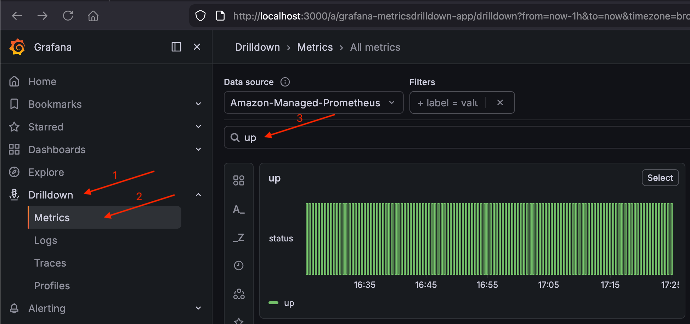
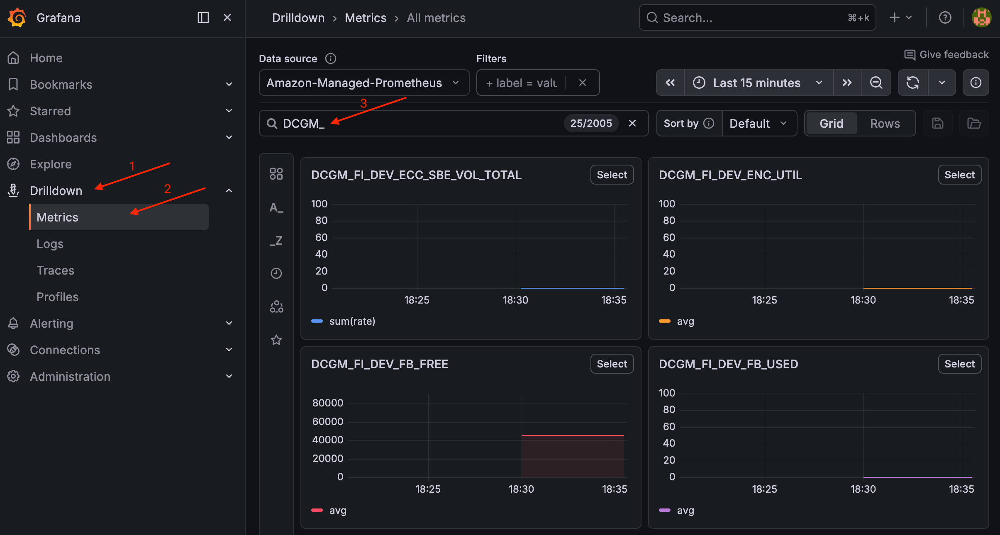
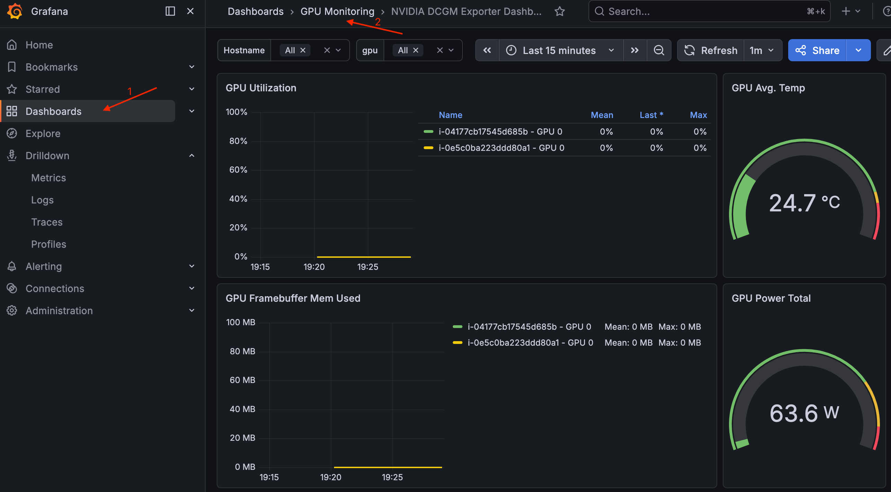

# Set Up Monitoring

Kubernetes users often use Prometheus for metrics collection, but managing long-term metrics storage, high availability, and aggregation across multiple clusters adds operational overhead. In this guide we use Amazon Managed Prometheus (AMP) to handle metrics storage so that metrics persist even when GPU nodes are interrupted or scaled down. AMP also makes it easy to aggregate metrics from multiple clusters in a single query endpoint. We will use the kube-prometheus-stack Helm chart to scrape metrics from the cluster and remote-write them to AMP.

For visualization, Amazon Managed Grafana (AMG) is available but requires Active Directory integration for authentication, which is beyond the scope of this guide. Instead, we use the self-managed Grafana that comes with the kube-prometheus-stack Helm chart.

If you are starting from this section or opened a new terminal, set the environment variables from the previous steps:

```bash
# NOTE: Keep this cluster name consistent throughout the guide. Do not modify.
export CLUSTER_NAME=eks-docs-inf
export AWS_REGION=us-east-2
```

## Create AMP Workspace

Create an AMP workspace to store metrics:

```bash
aws amp create-workspace \
  --alias "amp-ws-${CLUSTER_NAME}" \
  --region ${AWS_REGION}
```

Get the workspace ID:

```bash
AMP_WORKSPACE_ID=$(aws amp list-workspaces \
  --alias "amp-ws-${CLUSTER_NAME}" \
  --query 'workspaces[0].workspaceId' \
  --output text \
  --region ${AWS_REGION})

echo "AMP Workspace ID: ${AMP_WORKSPACE_ID}"
```

Get the remote write endpoint:

```bash
AMP_ENDPOINT=$(aws amp describe-workspace \
  --workspace-id ${AMP_WORKSPACE_ID} \
  --query 'workspace.prometheusEndpoint' \
  --output text \
  --region ${AWS_REGION})

echo "AMP Endpoint: ${AMP_ENDPOINT}"
```

Create an IAM policy that allows Prometheus to remote-write metrics and Grafana to query them:

```bash
cat << EOF > /tmp/amp-grafana-policy.json
{
  "Version": "2012-10-17",
  "Statement": [
    {
      "Sid": "AllowAMPReadWrite",
      "Effect": "Allow",
      "Action": [
        "aps:ListWorkspaces",
        "aps:DescribeWorkspace",
        "aps:GetMetricMetadata",
        "aps:GetSeries",
        "aps:QueryMetrics",
        "aps:RemoteWrite",
        "aps:GetLabels"
      ],
      "Resource": "arn:aws:aps:${AWS_REGION}:$(aws sts get-caller-identity --query Account --output text):workspace/*"
    },
    {
      "Sid": "AllowCloudWatchMetrics",
      "Effect": "Allow",
      "Action": [
        "cloudwatch:DescribeAlarmsForMetric",
        "cloudwatch:ListMetrics",
        "cloudwatch:GetMetricData",
        "cloudwatch:GetMetricStatistics"
      ],
      "Resource": "*"
    }
  ]
}
EOF

AMP_POLICY_ARN=$(aws iam create-policy \
  --policy-name "${CLUSTER_NAME}-amp-grafana-policy" \
  --policy-document file:///tmp/amp-grafana-policy.json \
  --query 'Policy.Arn' \
  --output text)

echo "AMP Policy ARN: ${AMP_POLICY_ARN}"
```

Create the monitoring namespace and service accounts for Prometheus and Grafana:

```bash
kubectl create namespace monitoring

kubectl create serviceaccount amp-iamproxy-ingest-service-account -n monitoring
kubectl create serviceaccount grafana-sa -n monitoring
```

Create Pod Identity Associations to link the service accounts to the IAM policy:

```bash
eksctl create podidentityassociation \
  --cluster ${CLUSTER_NAME} \
  --namespace monitoring \
  --service-account-name amp-iamproxy-ingest-service-account \
  --role-name "${CLUSTER_NAME}-amp-ingest-role" \
  --permission-policy-arns ${AMP_POLICY_ARN} \
  --region ${AWS_REGION}

eksctl create podidentityassociation \
  --cluster ${CLUSTER_NAME} \
  --namespace monitoring \
  --service-account-name grafana-sa \
  --role-name "${CLUSTER_NAME}-grafana-role" \
  --permission-policy-arns ${AMP_POLICY_ARN} \
  --region ${AWS_REGION}
```

Verify both Pod Identity associations were created:

```bash
eksctl get podidentityassociation --cluster ${CLUSTER_NAME} --region ${AWS_REGION}
```

Expected output should include both `amp-iamproxy-ingest-service-account` and `grafana-sa` in the `monitoring` namespace:

```
ASSOCIATION ARN                                                                             NAMESPACE    SERVICE ACCOUNT NAME                   IAM ROLE ARN
arn:aws:eks:us-east-2:123456789012:podidentityassociation/eks-docs-inf/a-xxxxxxxxxxxxxxxxx  monitoring   amp-iamproxy-ingest-service-account    arn:aws:iam::123456789012:role/eks-docs-inf-amp-ingest-role
arn:aws:eks:us-east-2:123456789012:podidentityassociation/eks-docs-inf/a-yyyyyyyyyyyyyyyyy  monitoring   grafana-sa                             arn:aws:iam::123456789012:role/eks-docs-inf-grafana-role
```

## Install kube-prometheus-stack

Add the Helm repo:

```bash
helm repo add prometheus-community https://prometheus-community.github.io/helm-charts
helm repo update
```

Create a values file for the Helm chart:

```bash
cat << EOF > /tmp/kube-prometheus-values.yaml
prometheus:
  serviceAccount:
    create: false
    name: amp-iamproxy-ingest-service-account
  prometheusSpec:
    serviceAccountName: amp-iamproxy-ingest-service-account
    remoteWrite:
      - url: "${AMP_ENDPOINT}api/v1/remote_write"
        sigv4:
          region: "${AWS_REGION}"
        queueConfig:
          maxSamplesPerSend: 1000
          maxShards: 200
          capacity: 2500
    retention: 5h
    scrapeInterval: 30s
    evaluationInterval: 30s
    podMonitorSelectorNilUsesHelmValues: false
    serviceMonitorSelectorNilUsesHelmValues: false

alertmanager:
  enabled: false

grafana:
  enabled: true
  serviceAccount:
    create: false
    name: grafana-sa
  grafana.ini:
    auth:
      sigv4_auth_enabled: true
  sidecar:
    datasources:
      defaultDatasourceEnabled: false
  plugins:
    - grafana-amazonprometheus-datasource
  additionalDataSources:
    - name: Amazon-Managed-Prometheus
      type: grafana-amazonprometheus-datasource
      access: proxy
      url: "${AMP_ENDPOINT}"
      isDefault: true
      jsonData:
        sigV4Auth: true
        defaultRegion: "${AWS_REGION}"
        sigV4Region: "${AWS_REGION}"
      editable: true
  dashboardProviders:
    dashboardproviders.yaml:
      apiVersion: 1
      providers:
        - name: default
          orgId: 1
          folder: 'GPU Monitoring'
          type: file
          disableDeletion: false
          editable: true
          options:
            path: /var/lib/grafana/dashboards/default
  dashboards:
    default:
      nvidia-dcgm:
        gnetId: 25261
        revision: 1
        datasource:
          - name: DS_PROMETHEUS
            value: Amazon-Managed-Prometheus
      vllm:
        gnetId: 25263
        revision: 1
        datasource:
          - name: DS_PROMETHEUS
            value: Amazon-Managed-Prometheus

EOF
```

Validate the variables were populated correctly in the values file:

```bash
grep -E "url:|region:" /tmp/kube-prometheus-values.yaml
```

You should see the full AMP endpoint URL (starting with `https://aps-workspaces...`) and your region. If any values are empty, re-export `AMP_ENDPOINT` and `AWS_REGION` and recreate the file.

Install the kube-prometheus-stack helm chart:

```bash
helm install kube-prometheus-stack prometheus-community/kube-prometheus-stack \
  --namespace monitoring \
  -f /tmp/kube-prometheus-values.yaml
```

Verify the pods are running:

```bash
kubectl get pods -n monitoring
```

Expected output:

```
NAME                                                       READY   STATUS    RESTARTS   AGE
kube-prometheus-stack-grafana-7c58f54f77-rftrj             3/3     Running   0          4m
kube-prometheus-stack-kube-state-metrics-d68dcbc84-5smxq   1/1     Running   0          4m
kube-prometheus-stack-operator-5895df479f-ttm47            1/1     Running   0          4m
kube-prometheus-stack-prometheus-node-exporter-t9q7s       1/1     Running   0          4m
kube-prometheus-stack-prometheus-node-exporter-x6vfb       1/1     Running   0          4m
prometheus-kube-prometheus-stack-prometheus-0              2/2     Running   0          4m
```

The stack deploys the following components:

- **Prometheus** (StatefulSet): scrapes metrics and remote-writes to AMP
- **Grafana**: dashboards and visualization, configured with the AMP datasource
- **kube-state-metrics**: generates metrics about Kubernetes object states (pod status, resource requests/limits, NodeClaim states)
- **node-exporter** (DaemonSet, one per node): collects host-level metrics (CPU, memory, disk, network) which helps identify bottlenecks on GPU nodes
- **operator**: manages the Prometheus and Alertmanager custom resources

Prometheus scrapes metrics from node-exporter and kube-state-metrics via ServiceMonitors that the Helm chart automatically configures, then remote-writes all collected metrics to AMP. Grafana queries AMP to display dashboards. Alertmanager is disabled in this setup.

## Access Grafana

Open a separate terminal windown and port-forward to access the Grafana dashboard:

```bash
kubectl port-forward svc/kube-prometheus-stack-grafana 3000:80 -n monitoring
```

Open http://localhost:3000 in your browser. Log in with username `admin` and the Grafana admin password from the following command:

```bash
kubectl --namespace monitoring get secrets kube-prometheus-stack-grafana -o jsonpath="{.data.admin-password}" | base64 -d ; echo
```

## Verify Metrics Pipeline

After logging in to Grafana, verify the metrics pipeline is working end-to-end:

1. Navigate to **Connections > Data sources** and confirm "Amazon-Managed-Prometheus" is listed as the default datasource


2. Navigate to **Drilldown > Metrics** and search for the `up` metric. You should see results from your cluster's scrape targets



If `up` shows results, the full pipeline (cluster → Prometheus → AMP → Grafana) is working.

## Deploy DCGM Exporter for GPU Metrics

The kube-prometheus-stack scrapes node-level CPU/memory metrics but does not collect GPU-specific metrics. To get GPU utilization, memory usage, temperature, and power draw in Grafana, deploy the NVIDIA DCGM Exporter:

```bash
helm repo add gpu-helm-charts https://nvidia.github.io/dcgm-exporter/helm-charts
helm repo update
```

```bash
cat << 'EOF' > /tmp/dcgm-exporter-values.yaml
resources:
  requests:
    memory: "512Mi"
    cpu: "100m"
  limits:
    memory: "1Gi"
    cpu: "500m"

serviceMonitor:
  enabled: true
  additionalLabels:
    release: kube-prometheus-stack

nodeSelector:
  eks.amazonaws.com/instance-gpu-manufacturer: nvidia

tolerations:
  - key: "nvidia.com/gpu"
    operator: "Exists"
    effect: "NoSchedule"

customMetrics: |
  # Clocks
  DCGM_FI_DEV_SM_CLOCK,  gauge, SM clock frequency (in MHz).
  DCGM_FI_DEV_MEM_CLOCK, gauge, Memory clock frequency (in MHz).
  # Temperature
  DCGM_FI_DEV_MEMORY_TEMP, gauge, Memory temperature (in C).
  DCGM_FI_DEV_GPU_TEMP,    gauge, GPU temperature (in C).
  # Power
  DCGM_FI_DEV_POWER_USAGE,              gauge, Power draw (in W).
  DCGM_FI_DEV_TOTAL_ENERGY_CONSUMPTION, counter, Total energy consumption since boot (in mJ).
  # PCIe
  DCGM_FI_PROF_PCIE_TX_BYTES,  counter, Number of bytes transmitted through PCIe TX (in KB) via NVML.
  DCGM_FI_PROF_PCIE_RX_BYTES,  counter, Number of bytes received through PCIe RX (in KB) via NVML.
  DCGM_FI_DEV_PCIE_REPLAY_COUNTER, counter, Total number of PCIe retries.
  # Utilization (the sample period varies depending on the product)
  DCGM_FI_DEV_GPU_UTIL,      gauge, GPU utilization (in %).
  DCGM_FI_DEV_MEM_COPY_UTIL, gauge, Memory utilization (in %).
  DCGM_FI_DEV_ENC_UTIL,      gauge, Encoder utilization (in %).
  DCGM_FI_DEV_DEC_UTIL,      gauge, Decoder utilization (in %).
  # Errors and violations
  DCGM_FI_DEV_XID_ERRORS,            gauge, Value of the last XID error encountered.
  DCGM_EXP_XID_ERRORS_COUNT,         gauge, Value of count of XID errors encountered.
  DCGM_FI_DEV_POWER_VIOLATION,       counter, Throttling duration due to power constraints (in us).
  DCGM_FI_DEV_THERMAL_VIOLATION,     counter, Throttling duration due to thermal constraints (in us).
  DCGM_FI_DEV_SYNC_BOOST_VIOLATION,  counter, Throttling duration due to sync-boost constraints (in us).
  DCGM_FI_DEV_BOARD_LIMIT_VIOLATION, counter, Throttling duration due to board limit constraints (in us).
  DCGM_FI_DEV_LOW_UTIL_VIOLATION,    counter, Throttling duration due to low utilization (in us).
  DCGM_FI_DEV_RELIABILITY_VIOLATION, counter, Throttling duration due to reliability constraints (in us).
  # Memory usage
  DCGM_FI_DEV_FB_FREE, gauge, Framebuffer memory free (in MiB).
  DCGM_FI_DEV_FB_USED, gauge, Framebuffer memory used (in MiB).
  # Retired pages
  DCGM_FI_DEV_RETIRED_SBE,     counter, Total number of retired pages due to single-bit errors.
  DCGM_FI_DEV_RETIRED_DBE,     counter, Total number of retired pages due to double-bit errors.
  DCGM_FI_DEV_RETIRED_PENDING, counter, Total number of pages pending retirement.
  # NVLink
  DCGM_FI_DEV_NVLINK_BANDWIDTH_TOTAL, counter, Total number of NVLink bandwidth counters for all lanes.
  DCGM_FI_PROF_NVLINK_TX_BYTES,       counter, The rate of data transmitted over NVLink not including protocol headers in bytes per second.
  DCGM_FI_PROF_NVLINK_RX_BYTES,       counter, The rate of data received over NVLink not including protocol headers in bytes per second.
  # DCP metrics
  DCGM_FI_PROF_GR_ENGINE_ACTIVE,   gauge, Ratio of time the graphics engine is active (in %).
  DCGM_FI_PROF_SM_ACTIVE,          gauge, The ratio of cycles an SM has at least 1 warp assigned (in %).
  DCGM_FI_PROF_SM_OCCUPANCY,       gauge, The ratio of number of warps resident on an SM (in %).
  DCGM_FI_PROF_PIPE_TENSOR_ACTIVE, gauge, Ratio of cycles the tensor (HMMA) pipe is active (in %).
  DCGM_FI_PROF_DRAM_ACTIVE,        gauge, Ratio of cycles the device memory interface is active sending or receiving data (in %).
  DCGM_FI_DEV_CLOCK_THROTTLE_REASONS, gauge, Current clock throttle reasons (bitmask of DCGM_CLOCKS_THROTTLE_REASON_*).
  DCGM_FI_DEV_GPU_NVLINK_ERRORS,      gauge, Identifies a GPU NVLink error type returned by DCGM_FI_DEV_GPU_NVLINK_ERRORS.
  ## NVLink
  DCGM_FI_DEV_NVLINK_BANDWIDTH_L0, counter, The number of bytes of active NVLink rx or tx data including both header and payload.
  ## Remapped rows
  DCGM_FI_DEV_UNCORRECTABLE_REMAPPED_ROWS, counter, Number of remapped rows for uncorrectable errors.
  DCGM_FI_DEV_CORRECTABLE_REMAPPED_ROWS, counter, Number of remapped rows for correctable errors.
  DCGM_FI_DEV_ROW_REMAP_FAILURE, gauge, whether remapping of rows has failed.
  ## Profiling metrics
  DCGM_FI_PROF_PIPE_FP64_ACTIVE, gauge, Ratio of cycles the fp64 pipes are active (in %).
  DCGM_FI_PROF_PIPE_FP32_ACTIVE, gauge, Ratio of cycles the fp32 pipes are active (in %).
  DCGM_FI_PROF_PIPE_FP16_ACTIVE, gauge, Ratio of cycles the fp16 pipes are active (in %).
  # ECC
  DCGM_FI_DEV_ECC_SBE_VOL_TOTAL, counter, Total number of single-bit volatile ECC errors.
  DCGM_FI_DEV_ECC_DBE_VOL_TOTAL, counter, Total number of double-bit volatile ECC errors.
EOF
```

The DCGM exporter ships with a default set of metrics that cover GPU utilization and memory. The `customMetrics` field overrides that with an extended set that includes NVLink bandwidth, tensor core activity, PCIe throughput, ECC errors, and thermal throttling. For inference workloads these help you understand:

- Whether the GPU compute units are fully utilized (low `SM_OCCUPANCY`, low `PIPE_TENSOR_ACTIVE`)
- Whether the GPU is idle between requests due to low batch sizes (few concurrent inference requests means the GPU finishes quickly and waits)
- If data transfer between CPU and GPU is a bottleneck (`PCIE_TX/RX_BYTES`), which can indicate the model weights are being loaded from host memory instead of staying on the GPU
- If thermal throttling is causing latency spikes (`THERMAL_VIOLATION`)
- How much GPU memory headroom remains for larger batches (`FB_FREE`/`FB_USED`)

```bash
helm install dcgm-exporter gpu-helm-charts/dcgm-exporter \
  --namespace monitoring \
  -f /tmp/dcgm-exporter-values.yaml
```

The `tolerations` allow the exporter to run on GPU-tainted nodes. The `serviceMonitor` with the `release: kube-prometheus-stack` label ensures Prometheus discovers and scrapes it automatically.

Verify the DCGM exporter DaemonSet is deployed:

```bash
kubectl get daemonset dcgm-exporter -n monitoring
```

Expected output (with a GPU node running):

```
NAME            DESIRED   CURRENT   READY   UP-TO-DATE   AVAILABLE   NODE SELECTOR                                        AGE
dcgm-exporter   1         1         1       1            1           eks.amazonaws.com/instance-gpu-manufacturer=nvidia   59s
```

After a few minutes, GPU metrics will be available in Grafana.

To validate DCGM metrics, navigate to **Drilldown > Metrics** and search for `DCGM_`. You should see all the DCGM metrics flowing from your GPU nodes.



To view the DCGM Dashboard, navigate to **Dashboards > GPU Monitoring > NVIDIA DCGM Exporter Dashboard**. The dashboard shows GPU temperature, power usage, memory utilization, SM clocks, and tensor core activity.



---

[← Previous: Set up S3 model storage](02-s3-model-storage.md) | [Back to main guide](README.md)

---

## Cleanup

> **Note:** If you plan to keep using monitoring with the cluster, skip the cleanup. Only run it when you are done with monitoring.

### Clean Up Monitoring

If you are starting from a new terminal, set the cluster name and region:

```bash
export CLUSTER_NAME=eks-docs-inf
export AWS_REGION=us-east-2
```

Look up the IAM policy ARN:

```bash
AMP_POLICY_ARN=$(aws iam list-policies \
  --scope Local \
  --query "Policies[?PolicyName=='${CLUSTER_NAME}-amp-grafana-policy'].Arn" \
  --output text)
echo "AMP Policy ARN: ${AMP_POLICY_ARN}"
```

Look up the AMP workspace ID:

```bash
AMP_WORKSPACE_ID=$(aws amp list-workspaces \
  --alias "amp-ws-${CLUSTER_NAME}" \
  --query 'workspaces[0].workspaceId' \
  --output text \
  --region ${AWS_REGION})
echo "AMP Workspace ID: ${AMP_WORKSPACE_ID}"
```

Uninstall the DCGM exporter Helm release:

```bash
helm uninstall dcgm-exporter -n monitoring
```

Uninstall the kube-prometheus-stack Helm release:

```bash
helm uninstall kube-prometheus-stack -n monitoring
```

Delete the Pod Identity association for the Prometheus ingest service account:

```bash
eksctl delete podidentityassociation \
  --cluster ${CLUSTER_NAME} \
  --namespace monitoring \
  --service-account-name amp-iamproxy-ingest-service-account \
  --region ${AWS_REGION}
```

Delete the Pod Identity association for the Grafana service account:

```bash
eksctl delete podidentityassociation \
  --cluster ${CLUSTER_NAME} \
  --namespace monitoring \
  --service-account-name grafana-sa \
  --region ${AWS_REGION}
```

Delete the IAM policy used by Prometheus and Grafana:

```bash
aws iam delete-policy --policy-arn ${AMP_POLICY_ARN}
```

Delete the AMP workspace:

```bash
aws amp delete-workspace --workspace-id ${AMP_WORKSPACE_ID} --region ${AWS_REGION}
```

Delete the monitoring namespace:

```bash
kubectl delete namespace monitoring
```

---

[← Previous: Cleanup S3 model storage](02-s3-model-storage.md#cleanup) | [Back to main guide](README.md)
