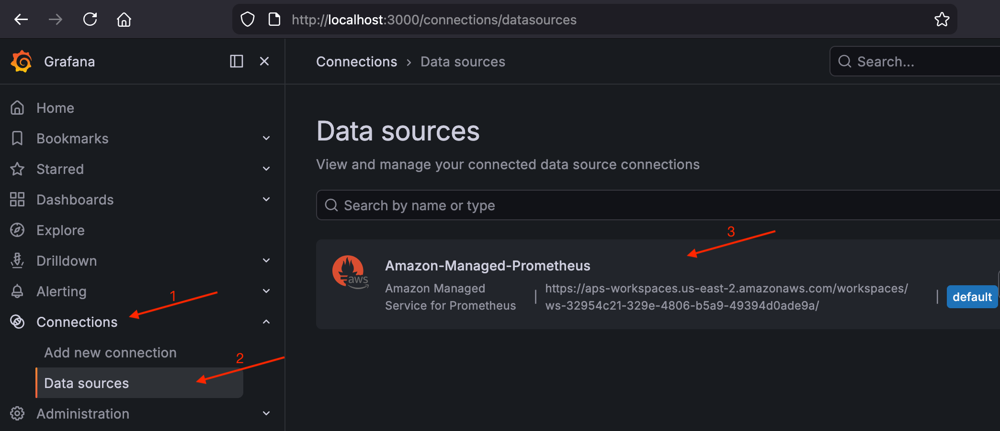

# GPU Inference

This section contains instructions to create an EKS Auto Mode cluster with GPU NodePools optimized for inference workloads, as depicted in the following diagram:


_Diagram 1: EKS Auto Mode cluster with a static ODCR-backed GPU node and a dynamic Spot/On-Demand overflow NodePool for inference workloads._

## Prerequisites

- eksctl >= 0.225.0
- kubectl
- AWS CLI
- Helm

## Create EKS Auto Mode Cluster

Create an EKS cluster with Auto Mode enabled using eksctl:

```bash
# NOTE: Keep this cluster name consistent throughout the guide. Do not modify.
export CLUSTER_NAME=eks-docs-inf
export AWS_REGION=us-east-2
```

By default, eksctl creates a cluster in 2 AZs. Using all available AZs improves fault tolerance and increases the chances of obtaining GPU capacity. Check the available AZs in your region:

```bash
export AZS=$(aws ec2 describe-availability-zones \
  --region ${AWS_REGION} \
  --query "AvailabilityZones[?ZoneId!='use1-az3' && ZoneId!='usw1-az2' && ZoneId!='cac1-az3'].ZoneName" \
  --output text | tr '\t' ',')
echo $AZS
```

> **Note:** The Availability Zones `use1-az3`, `usw1-az2`, and `cac1-az3` are excluded because [Amazon EKS does not support control plane placement in those zones](https://repost.aws/knowledge-center/eks-cluster-creation-errors). Creating a cluster with subnets in any of these zones results in an `UnsupportedAvailabilityZoneException`.

Expected output:

```
us-east-2a,us-east-2b,us-east-2c
```

In this example we create the cluster across all 3 AZs in us-east-2:

```bash
eksctl create cluster \
  --name=$CLUSTER_NAME \
  --region=$AWS_REGION \
  --enable-auto-mode \
  --zones=$AZS
```

This command takes a few minutes to complete. After completion, eksctl automatically updates your kubeconfig and points your newly created cluster. To verify that the cluster is operational:

```bash
kubectl get pods --all-namespaces
```

Sample output:

```
NAMESPACE     NAME                              READY   STATUS    RESTARTS   AGE
kube-system   metrics-server-55cf976ddd-cz2mw   1/1     Running   0          3m
kube-system   metrics-server-55cf976ddd-wrjvv   1/1     Running   0          3m
```

## Create GPU NodePool for Inference

Create a dynamic scaling GPU NodePool. Note: the following command will not provision GPU instances. It creates a template that Karpenter uses to provision GPU nodes when a matching pod is scheduled.

```bash
cat << 'EOF' | kubectl apply -f -
apiVersion: karpenter.sh/v1
kind: NodePool
metadata:
  name: gpu-inf-dynamic
spec:
  template:
    metadata:
      labels:
        guide: eks-docs-inf
    spec:
      nodeClassRef:
        group: eks.amazonaws.com
        kind: NodeClass
        name: default
      taints:
        - key: nvidia.com/gpu
          value: Exists
          effect: NoSchedule
      requirements:
        - key: karpenter.sh/capacity-type
          operator: In
          values: ["spot", "on-demand"]
        - key: eks.amazonaws.com/instance-category
          operator: In
          values: ["g"]
        - key: eks.amazonaws.com/instance-generation
          operator: Gt
          values: ["4"]
        - key: kubernetes.io/arch
          operator: In
          values: ["amd64"]
  limits:
    cpu: 100
    memory: 100Gi
EOF
```

This NodePool will provision GPU instances in the `g` category with generation greater than 4 (such as G5 and G6e). It uses the `default` NodeClass, which automatically selects the appropriate AMI variant based on the instance type (accelerated AMI for GPU instances, standard AMI for CPU instances). The `nvidia.com/gpu:NoSchedule` taint ensures only GPU-eligible pods are scheduled on these nodes. The `karpenter.sh/capacity-type` includes both On-Demand and Spot, which lets Karpenter pick the most cost-effective option with available capacity.

Validate the NodePool was created successfully:

```bash
kubectl get nodepools
```

Expected output:

```
NAME              NODECLASS   NODES   READY   AGE
general-purpose   default     0       True    15m
gpu-inf-dynamic   default     0       True    8s
system            default     2       True    15m
```

The `gpu-inf-dynamic` NodePool starts with zero nodes. Karpenter will automatically provision a GPU node when a pod with matching tolerations and resource requests is scheduled.

### Test with a Sample Pod

We will test with a sample pod requesting a single GPU using `nvidia-smi` (NVIDIA System Management Interface), a standard diagnostic tool used to verify GPU availability, driver versions, and device health. When we deploy the following sample pod, Auto Mode will provision a GPU node and the NVIDIA device plugin will expose GPUs to the container runtime:

```bash
cat << EOF | kubectl apply -f -
apiVersion: v1
kind: Pod
metadata:
  name: nvidia-smi
  labels:
    guide: eks-docs-inf
spec:
  tolerations:
  - key: "nvidia.com/gpu"
    operator: "Exists"
    effect: "NoSchedule"
  containers:
  - name: nvidia-smi
    image: public.ecr.aws/amazonlinux/amazonlinux:2023-minimal
    command: ["nvidia-smi"]
    resources:
      limits:
        nvidia.com/gpu: 1
  restartPolicy: OnFailure
EOF
```

Verify the pod is scheduled and completed successfully.

```bash
kubectl get pods
```

Expected output:

```
NAME         READY   STATUS      RESTARTS   AGE
nvidia-smi   0/1     Completed   0          71s
```

The `STATUS: Completed` means the `nvidia-smi` command ran and exited. Check the pod logs to see the GPU detected by the node.

```bash
kubectl logs nvidia-smi
```

Expected output:

```
+-----------------------------------------------------------------------------------------+
| NVIDIA-SMI 580.126.09             Driver Version: 580.126.09     CUDA Version: 13.0     |
+-----------------------------------------+------------------------+----------------------+
| GPU  Name                 Persistence-M | Bus-Id          Disp.A | Volatile Uncorr. ECC |
| Fan  Temp   Perf          Pwr:Usage/Cap |           Memory-Usage | GPU-Util  Compute M. |
|                                         |                        |               MIG M. |
|=========================================+========================+======================|
|   0  NVIDIA RTX PRO 6000 Blac...    On  |   00000000:2B:00.0 Off |                    0 |
| N/A   30C    P0             81W /  600W |       0MiB /  97887MiB |      0%      Default |
|                                         |                        |             Disabled |
+-----------------------------------------+------------------------+----------------------+
```

The output shows the GPU model, driver version, CUDA version, and available memory. In this example, Karpenter provisioned a G7e instance which has an NVIDIA RTX PRO 6000 Blackwell GPU with 96 GB of memory. The 30C is the current GPU temperature and P0 means the GPU is in its highest performance state (idle but ready). The `81W / 600W` shows current power draw vs max power capacity, and `0MiB / 97887MiB` shows current GPU memory used vs total available. Since the pod just ran `nvidia-smi` and exited, no workload is using the GPU so memory is at 0 and power is at idle. The NVIDIA GPU driver version (580.126.09) comes from the Bottlerocket AMI, while the CUDA version (13.0) comes from the container image. The GPU model and memory will vary depending on the instance type Karpenter selects. G5 instances have NVIDIA A10G GPUs (24 GB), G6e instances have NVIDIA L40S GPUs (48 GB), and G7e instances have NVIDIA RTX PRO 6000 GPUs (96 GB).

To understand how Karpenter and the scheduler coordinated to provision a node and place the pod, check the pod's lifecycle events:

```bash
kubectl describe po nvidia-smi
```

Expected output:

```
Events:
  Type     Reason                  Age   From                   Message
  ----     ------                  ----  ----                   -------
  Warning  FailedScheduling        67s   default-scheduler      0/2 nodes are available: 2 node(s) had untolerated taint(s). no new claims to deallocate, preemption: 0/2 nodes are available: 2 Preemption is not helpful for scheduling.
  Normal   Nominated               67s   eks-auto-mode/compute  Pod should schedule on: nodeclaim/gpu-inf-dynamic-ggsvc
  Normal   Scheduled               31s   default-scheduler      Successfully assigned default/nvidia-smi to i-01ea29a35bb334680
  Normal   Pulling                 10s   kubelet                spec.containers{nvidia-smi}: Pulling image "public.ecr.aws/amazonlinux/amazonlinux:2023-minimal"
  Normal   Pulled                  8s    kubelet                spec.containers{nvidia-smi}: Successfully pulled image "public.ecr.aws/amazonlinux/amazonlinux:2023-minimal" in 1.475s (1.475s including waiting). Image size: 37442365 bytes.
  Normal   Created                 8s    kubelet                spec.containers{nvidia-smi}: Created container: nvidia-smi
  Normal   Started                 8s    kubelet                spec.containers{nvidia-smi}: Started container nvidia-smi
```

These events show the pod scheduling sequence: the pod initially fails to schedule because no GPU nodes exist (`FailedScheduling`), Karpenter nominates a new NodeClaim (`Nominated`), the scheduler assigns the pod once the node is ready (`Scheduled`), and then the container image is pulled and started.

A NodeClaim is a request Karpenter creates to provision a specific node. It shows the instance type, capacity type, AZ, and whether the node is ready.

```bash
kubectl get nodeclaims
```

Expected output:

```
NAME                    TYPE          CAPACITY    ZONE         NODE                  READY   AGE
gpu-inf-dynamic-xxxxx   g7e.2xlarge   spot        us-east-2b   i-0xxxxxxxxxxxx       True    2m
```

The NodeClaim shows that Karpenter picked a `g7e.2xlarge` Spot instance in `us-east-2b`. The instance type and AZ will vary based on what capacity is available at the time.

Check the node details:

```bash
kubectl get nodes -o wide
```

Expected output should show a GPU node with the Bottlerocket Nvidia AMI:

```
NAME                  STATUS   ROLES    AGE     VERSION               INTERNAL-IP       EXTERNAL-IP   OS-IMAGE                                                              KERNEL-VERSION   CONTAINER-RUNTIME
i-01xxxxxxxxxxxxxxx   Ready    <none>   56s     v1.34.4-eks-f69f56f   192.168.151.199   <none>        Bottlerocket (EKS Auto, Nvidia) 2026.4.23 (aws-k8s-1.34-nvidia)       6.12.79          containerd://2.1.6+bottlerocket
```

The `OS-IMAGE` column shows `Bottlerocket (EKS Auto, Nvidia)`, which is the accelerated Bottlerocket AMI variant with pre-installed NVIDIA drivers and device plugins. EKS Auto Mode automatically selected this AMI because the pod requested a GPU resource, without requiring any additional AMI configuration or launch templates. Karpenter will automatically remove the node 30 seconds after no pod is running, so if the job completed but no node shows up, that is expected.

Check the `gpu-inf-dynamic` NodePool to validate Karpenter provisioned the instance from it:

```bash
kubectl get nodepools gpu-inf-dynamic
```

Expected output:

```
NAME              NODECLASS   NODES   READY   AGE
gpu-inf-dynamic   default     1       True    5m
```

`NODES: 1` means Karpenter provisioned one node from this NodePool. If `NODES: 0`, either the pod hasn't triggered provisioning yet or the node was already removed after the job completed.

> **Troubleshooting tip:** If the pod is not scheduling and no node appears, check for Insufficient Capacity Errors (ICE). An ICE occurs when the requested instance type is temporarily unavailable in the targeted Availability Zone.

```bash
kubectl get events | grep InsufficientCapacityError
```

If you see `Unable to fulfill capacity due to your request configuration`, Karpenter caches that specific offering (instance type + AZ + capacity type) as unavailable for 3 minutes and will not retry it during that window. Other eligible offerings remain active, so Karpenter will try different instance types or AZs immediately. Widening the set of allowed instance types and AZs in your NodePool increases the chances of landing capacity.

> **Note:** Spot instances launched by Karpenter will not appear in the EC2 Spot Requests console. Karpenter uses the EC2 `CreateFleet` API with `type: instant`, which provisions instances synchronously without creating a Spot Request object. The instances appear in the EC2 Instances console with a `spot` lifecycle.

## Use On-Demand Capacity Reservation (ODCR) with Spot Overflow

In this section we will create an On-Demand Capacity Reservation (ODCR) for one GPU instance and set up an additional static NodeClass and NodePool to utilize it. The static NodePool provisions the instance immediately, so the scheduler naturally places pods there first since it already exists. If the static node is full, additional pods go Pending and Karpenter provisions nodes from the dynamic `gpu-inf-dynamic` NodePool as overflow. We will add a soft node affinity (`preferredDuringSchedulingIgnoredDuringExecution`) with the `capacity: odcr` label to explicitly prefer the static node first, in case nodes from both the static and dynamic NodePools are running simultaneously.

### Create the Capacity Reservation, NodeClass, and NodePool

```bash
CR_AZ="us-east-2a"
INSTANCE_TYPE="g6e.xlarge"
```

> **Note**: If the command succeeds it will result in a charge for the reserved instance type until you manually cancel it with `aws ec2 cancel-capacity-reservation --capacity-reservation-id <id>`.

```bash
aws ec2 create-capacity-reservation \
  --instance-type $INSTANCE_TYPE \
  --instance-platform Linux/UNIX \
  --availability-zone "$CR_AZ" \
  --instance-count 1 \
  --instance-match-criteria open \
  --end-date-type unlimited
```

If you get an `InsufficientInstanceCapacity` error like the following, change the `CR_AZ` variable to a different AZ and run the command again:

```
An error occurred (InsufficientInstanceCapacity) when calling the CreateCapacityReservation operation (reached max retries: 2): Insufficient capacity.
```

Get and validate the Capacity Reservation ID:

```bash
CAPACITY_RESERVATION_ID=$(aws ec2 describe-capacity-reservations \
  --filters "Name=state,Values=active" "Name=instance-type,Values=$INSTANCE_TYPE" \
  --query 'CapacityReservations[0].CapacityReservationId' \
  --output text)

echo "Capacity Reservation ID: $CAPACITY_RESERVATION_ID"
```

Capacity reservation bindings are configured at the NodeClass level, and the `default` NodeClass is immutable, so we need to create a custom NodeClass. Without an ODCR, you could use the `default` NodeClass directly with a static `replicas` NodePool.

Get the node role from the `default` NodeClass (the custom NodeClass needs the same role):

```bash
NODE_ROLE=$(kubectl get nodeclass default -o jsonpath='{.spec.role}')
echo "Node Role: $NODE_ROLE"
```

Apply a NodeClass that references the Capacity Reservation:

```bash
cat << EOF | kubectl apply -f -
apiVersion: eks.amazonaws.com/v1
kind: NodeClass
metadata:
  name: gpu-inf-static
  labels:
    guide: eks-docs-inf
spec:
  role: "$NODE_ROLE"
  subnetSelectorTerms:
    - tags:
        alpha.eksctl.io/cluster-name: "$CLUSTER_NAME"
        kubernetes.io/role/internal-elb: "1"
  securityGroupSelectorTerms:
    - tags:
        aws:eks:cluster-name: "$CLUSTER_NAME"
  capacityReservationSelectorTerms:
    - id: "$CAPACITY_RESERVATION_ID"
EOF
```

The `subnetSelectorTerms` and `securityGroupSelectorTerms` use exact-match tag filters to find the right VPC resources. The `kubernetes.io/role/internal-elb: "1"` tag ensures nodes launch in private subnets only. Without it, Karpenter may place nodes in public subnets, giving them external IPs.

Validate the NodeClass was created successfully:

```bash
kubectl get nodeclass gpu-inf-static
```

Expected output:

```
NAME             ROLE                                                        READY   AGE
gpu-inf-static   eksctl-eks-docs-inf-cluster-AutoModeNodeRole-CGzs3dk0r3KQ   True    15s
```

Apply the static NodePool that uses the ODCR-backed NodeClass:

```bash
cat << 'EOF' | kubectl apply -f -
apiVersion: karpenter.sh/v1
kind: NodePool
metadata:
  name: gpu-inf-static
  labels:
    guide: eks-docs-inf
spec:
  replicas: 1
  template:
    metadata:
      labels:
        capacity: odcr
        guide: eks-docs-inf
    spec:
      nodeClassRef:
        group: eks.amazonaws.com
        kind: NodeClass
        name: gpu-inf-static
      requirements:
        - key: "node.kubernetes.io/instance-type"
          operator: In
          values: ["g6e.xlarge"]  # Must match $INSTANCE_TYPE
        - key: "karpenter.sh/capacity-type"
          operator: In
          values: ["on-demand"]
      taints:
        - key: "nvidia.com/gpu"
          effect: NoSchedule
EOF
```

This NodePool provisions a node immediately using the capacity reservation. It uses `replicas: 1` to keep one node running at all times. Karpenter resolves the reservation's AZ, instance type, and platform from EC2 automatically, so you don't need to specify the AZ in the NodePool requirements.

Validate the NodePool and node provisioning:

```bash
kubectl get nodepools
```

Expected output:

```
NAME              NODECLASS        NODES   READY   AGE
general-purpose   default          0       True    20m
gpu-inf-dynamic   default          0       True    10m
gpu-inf-static    gpu-inf-static   1       True    8s
system            default          2       True    20m
```

Wait for the ODCR node to provision (may take 5-10 minutes):

```bash
kubectl get nodes -o wide
```

Expected output should show the ODCR node with the Bottlerocket Nvidia AMI:

```
NAME                  STATUS   ROLES    AGE    VERSION               INTERNAL-IP       EXTERNAL-IP   OS-IMAGE                                                              KERNEL-VERSION   CONTAINER-RUNTIME
i-0xxxxxxxxxxxxxxxx   Ready    <none>   40s    v1.34.4-eks-f69f56f   192.168.186.126   <none>        Bottlerocket (EKS Auto, Nvidia) 2026.4.23 (aws-k8s-1.34-nvidia)       6.12.79          containerd://2.1.6+bottlerocket
```

### How Scheduling Works Across Both NodePools

Both NodePools use the same `nvidia.com/gpu` taint. A pod that tolerates this taint and requests GPUs can land on either:

1. The ODCR node is already running → scheduler places the pod there first
2. If the ODCR node is full, the pod goes Pending → Karpenter provisions a Spot/On-Demand node from the `gpu-inf-dynamic` NodePool

To explicitly prefer the static node, add a soft node affinity to your pod spec using the `capacity: odcr` label from the static NodePool.

### Test Overflow Scaling

Deploy a 2-replica Deployment that requests 1 GPU per pod. Since the static ODCR node (g6e.xlarge) has only 1 GPU, the first pod fills it and the second pod triggers Karpenter to scale the dynamic NodePool:

```bash
cat << 'EOF' | kubectl apply -f -
apiVersion: apps/v1
kind: Deployment
metadata:
  name: gpu-overflow-test
  labels:
    guide: eks-docs-inf
spec:
  replicas: 2
  selector:
    matchLabels:
      app: gpu-overflow-test
  template:
    metadata:
      labels:
        app: gpu-overflow-test
        guide: eks-docs-inf
    spec:
      tolerations:
        - key: nvidia.com/gpu
          operator: Exists
          effect: NoSchedule
      affinity:
        nodeAffinity:
          preferredDuringSchedulingIgnoredDuringExecution:
            - weight: 100
              preference:
                matchExpressions:
                  - key: capacity
                    operator: In
                    values: ["odcr"]
      containers:
        - name: nvidia-smi
          image: public.ecr.aws/amazonlinux/amazonlinux:2023-minimal
          command: ["sh", "-c", "nvidia-smi && sleep infinity"]
          resources:
            limits:
              nvidia.com/gpu: 1
EOF
```

Unlike the earlier nvidia-smi test pod which ran and exited, this Deployment keeps the pods running (`sleep infinity`) so they hold the GPU and don't release the node. The `preferredDuringSchedulingIgnoredDuringExecution` affinity with `capacity: odcr` tells the scheduler to prefer the static node. The first pod lands on the static capacity ODCR node, and the second pod goes Pending because the static node's GPU is full, and Karpenter provisions a new node from the dynamic NodePool.

Verify the pods scheduled on different nodes:

```bash
kubectl get pods -l app=gpu-overflow-test -o wide
```

Expected output:

```bash
NAME                                 READY   STATUS    RESTARTS   AGE     IP                NODE                  NOMINATED NODE   READINESS GATES
gpu-overflow-test-59b97944fb-lq56c   1/1     Running   0          2m42s   192.168.186.240   i-057692590480155da   <none>           <none>
gpu-overflow-test-59b97944fb-z4zcx   1/1     Running   0          2m42s   192.168.130.64    i-0521ecd1849fa0578   <none>           <none>
```

Notice that the two pods are running, each on different node.

Check that a new node was provisioned from the dynamic NodePool:

```bash
kubectl get nodepools
```

Expected output should show `gpu-inf-dynamic` now has 1 node:

```
NAME              NODECLASS        NODES   READY   AGE
general-purpose   default          0       True    30m
gpu-inf-dynamic   default          1       True    20m
gpu-inf-static    gpu-inf-static   1       True    10m
system            default          2       True    30m
```

Clean up the test deployment:

```bash
kubectl delete deployment gpu-overflow-test
```

## Create S3 Bucket for Model Storage

Create an S3 bucket to store model weights. The bucket name includes a random suffix to avoid naming conflicts:

```bash
BUCKET_SUFFIX=$(head -c 4 /dev/urandom | od -An -tx1 | tr -d ' \n')
MODEL_BUCKET="${CLUSTER_NAME}-models-${BUCKET_SUFFIX}"

aws s3 mb s3://${MODEL_BUCKET} --region ${AWS_REGION}
```

Expected output:

```
make_bucket: eks-docs-inf-models-01234567
```

S3 buckets created after January 2023 have server-side encryption (AES256) and public access blocking enabled by default.

## Configure Pod Identity for S3 Access

Create a Kubernetes ServiceAccount and associate it with an IAM role that has access to the model bucket. This allows pods using the ServiceAccount to read and write model weights from S3.

Create the ServiceAccount:

```bash
kubectl create serviceaccount model-storage-sa
```

Expected output:

```
serviceaccount/model-storage-sa created
```

Create an IAM policy that grants access to the model bucket:

```bash
cat << EOF > /tmp/s3-model-policy.json
{
  "Version": "2012-10-17",
  "Statement": [
    {
      "Effect": "Allow",
      "Action": [
        "s3:GetObject",
        "s3:PutObject",
        "s3:ListBucket",
        "s3:DeleteObject"
      ],
      "Resource": [
        "arn:aws:s3:::${MODEL_BUCKET}",
        "arn:aws:s3:::${MODEL_BUCKET}/*"
      ]
    }
  ]
}
EOF

POLICY_ARN=$(aws iam create-policy \
  --policy-name "${CLUSTER_NAME}-model-storage-policy" \
  --policy-document file:///tmp/s3-model-policy.json \
  --query 'Policy.Arn' \
  --output text)
```

Expected output:

```
Policy ARN: arn:aws:iam::123456789012:policy/eks-docs-inf-model-storage-policy
```

Create the Pod Identity Association using eksctl. This creates the IAM role with the correct trust policy and links it to the ServiceAccount:

```bash
eksctl create podidentityassociation \
  --cluster ${CLUSTER_NAME} \
  --namespace default \
  --service-account-name model-storage-sa \
  --role-name "${CLUSTER_NAME}-model-storage-role" \
  --permission-policy-arns ${POLICY_ARN} \
  --region ${AWS_REGION}
```

Verify the association:

```bash
eksctl get podidentityassociation --cluster ${CLUSTER_NAME} --region ${AWS_REGION}
```

Expected output:

```
ASSOCIATION ARN                                                                             NAMESPACE   SERVICE ACCOUNT NAME   IAM ROLE ARN
arn:aws:eks:us-east-2:123456789012:podidentityassociation/eks-docs-inf/a-xxxxxxxxxxxxx      default     model-storage-sa       arn:aws:iam::123456789012:role/eks-docs-inf-model-storage-role
```

Pods using `serviceAccountName: model-storage-sa` will now have access to the `${MODEL_BUCKET}` bucket.

### Validate S3 Access from a Pod

Run a pod with the AWS CLI using the `model-storage-sa` ServiceAccount to verify the pod identity is working and S3 access is configured correctly:

```bash
cat << EOF | kubectl apply -f -
apiVersion: v1
kind: Pod
metadata:
  name: s3-test
  labels:
    guide: eks-docs-inf
spec:
  serviceAccountName: model-storage-sa
  containers:
    - name: aws-cli
      image: public.ecr.aws/aws-cli/aws-cli:latest
      command:
        - sh
        - -c
        - |
          echo "=== Caller Identity ==="
          aws sts get-caller-identity
          echo ""
          echo "=== S3 Write Test ==="
          echo "pod identity works" | aws s3 cp - s3://${MODEL_BUCKET}/test.txt
          echo ""
          echo "=== S3 List Test ==="
          aws s3 ls s3://${MODEL_BUCKET}/
          echo ""
          echo "=== S3 Delete Test ==="
          aws s3 rm s3://${MODEL_BUCKET}/test.txt
  restartPolicy: Never
EOF
```

Wait for the pod to complete and check the logs:

```bash
kubectl wait --for=jsonpath='{.status.phase}'=Succeeded pod/s3-test --timeout=120s
kubectl logs s3-test
```

Expected output:

```
=== Caller Identity ===
{
    "UserId": "AROA...:eks-eks-docs-inf-model-s-...",
    "Account": "123456789012",
    "Arn": "arn:aws:sts::123456789012:assumed-role/eks-docs-inf-model-storage-role/eks-eks-docs-inf-model-s-..."
}

=== S3 Write Test ===
upload: - to s3://eks-docs-inf-models-01234567/test.txt

=== S3 List Test ===
2026-05-04 12:00:00         19 test.txt

=== S3 Delete Test ===
delete: s3://eks-docs-inf-models-01234567/test.txt
```

The caller identity confirms the pod assumed the `eks-docs-inf-model-storage-role` role via Pod Identity. The S3 commands confirm read and write access to the bucket.

Clean up the test pod:

```bash
kubectl delete pod s3-test
```

## Monitoring

Kubernetes users often use Prometheus for metrics collection, but managing long-term metrics storage, high availability, and aggregation across multiple clusters adds operational overhead. In this guide we use Amazon Managed Prometheus (AMP) to handle metrics storage so that metrics persist even when GPU nodes are interrupted or scaled down. AMP also makes it easy to aggregate metrics from multiple clusters in a single query endpoint. We will use the kube-prometheus-stack Helm chart to scrape metrics from the cluster and remote-write them to AMP. For visualization, Amazon Managed Grafana (AMG) is available but requires Active Directory integration for authentication, which is beyond the scope of this guide. Instead, we use the self-managed Grafana that comes with the kube-prometheus-stack Helm chart.

### Create AMP Workspace

```bash
aws amp create-workspace \
  --alias "amp-ws-${CLUSTER_NAME}" \
  --region ${AWS_REGION}
```

Get the workspace ID:

```bash
AMP_WORKSPACE_ID=$(aws amp list-workspaces \
  --alias "amp-ws-${CLUSTER_NAME}" \
  --query 'workspaces[0].workspaceId' \
  --output text \
  --region ${AWS_REGION})

echo "AMP Workspace ID: ${AMP_WORKSPACE_ID}"
```

Get the remote write endpoint:

```bash
AMP_ENDPOINT=$(aws amp describe-workspace \
  --workspace-id ${AMP_WORKSPACE_ID} \
  --query 'workspace.prometheusEndpoint' \
  --output text \
  --region ${AWS_REGION})

echo "AMP Endpoint: ${AMP_ENDPOINT}"
```

### Create IAM Policy for Prometheus and Grafana

Create an IAM policy that allows Prometheus to remote-write metrics and Grafana to query them:

```bash
cat << EOF > /tmp/amp-grafana-policy.json
{
  "Version": "2012-10-17",
  "Statement": [
    {
      "Sid": "AllowAMPReadWrite",
      "Effect": "Allow",
      "Action": [
        "aps:ListWorkspaces",
        "aps:DescribeWorkspace",
        "aps:GetMetricMetadata",
        "aps:GetSeries",
        "aps:QueryMetrics",
        "aps:RemoteWrite",
        "aps:GetLabels"
      ],
      "Resource": "arn:aws:aps:${AWS_REGION}:$(aws sts get-caller-identity --query Account --output text):workspace/*"
    },
    {
      "Sid": "AllowCloudWatchMetrics",
      "Effect": "Allow",
      "Action": [
        "cloudwatch:DescribeAlarmsForMetric",
        "cloudwatch:ListMetrics",
        "cloudwatch:GetMetricData",
        "cloudwatch:GetMetricStatistics"
      ],
      "Resource": "*"
    }
  ]
}
EOF

AMP_POLICY_ARN=$(aws iam create-policy \
  --policy-name "${CLUSTER_NAME}-amp-grafana-policy" \
  --policy-document file:///tmp/amp-grafana-policy.json \
  --query 'Policy.Arn' \
  --output text)

echo "AMP Policy ARN: ${AMP_POLICY_ARN}"
```

### Create Namespace and Service Accounts

```bash
kubectl create namespace monitoring

kubectl create serviceaccount amp-iamproxy-ingest-service-account -n monitoring
kubectl create serviceaccount grafana-sa -n monitoring
```

### Create Pod Identity Associations

```bash
eksctl create podidentityassociation \
  --cluster ${CLUSTER_NAME} \
  --namespace monitoring \
  --service-account-name amp-iamproxy-ingest-service-account \
  --role-name "${CLUSTER_NAME}-amp-ingest-role" \
  --permission-policy-arns ${AMP_POLICY_ARN} \
  --region ${AWS_REGION}

eksctl create podidentityassociation \
  --cluster ${CLUSTER_NAME} \
  --namespace monitoring \
  --service-account-name grafana-sa \
  --role-name "${CLUSTER_NAME}-grafana-role" \
  --permission-policy-arns ${AMP_POLICY_ARN} \
  --region ${AWS_REGION}
```

### Install kube-prometheus-stack

Add the Helm repo:

```bash
helm repo add prometheus-community https://prometheus-community.github.io/helm-charts
helm repo update
```

Create a values file for the Helm chart:

```bash
cat << EOF > /tmp/kube-prometheus-values.yaml
prometheus:
  serviceAccount:
    create: false
    name: amp-iamproxy-ingest-service-account
  prometheusSpec:
    serviceAccountName: amp-iamproxy-ingest-service-account
    remoteWrite:
      - url: "${AMP_ENDPOINT}api/v1/remote_write"
        sigv4:
          region: "${AWS_REGION}"
        queueConfig:
          maxSamplesPerSend: 1000
          maxShards: 200
          capacity: 2500
    retention: 5h
    scrapeInterval: 30s
    evaluationInterval: 30s
    podMonitorSelectorNilUsesHelmValues: false
    serviceMonitorSelectorNilUsesHelmValues: false

alertmanager:
  enabled: false

grafana:
  enabled: true
  serviceAccount:
    create: false
    name: grafana-sa
  grafana.ini:
    auth:
      sigv4_auth_enabled: true
  sidecar:
    datasources:
      defaultDatasourceEnabled: false
  plugins:
    - grafana-amazonprometheus-datasource
  additionalDataSources:
    - name: Amazon-Managed-Prometheus
      type: grafana-amazonprometheus-datasource
      access: proxy
      url: "${AMP_ENDPOINT}"
      isDefault: true
      jsonData:
        sigV4Auth: true
        defaultRegion: "${AWS_REGION}"
        sigV4Region: "${AWS_REGION}"
      editable: true
  dashboardProviders:
    dashboardproviders.yaml:
      apiVersion: 1
      providers:
        - name: default
          orgId: 1
          folder: 'inference'
          type: file
          disableDeletion: false
          editable: true
          options:
            path: /var/lib/grafana/dashboards/default
  dashboards:
    default:
      nvidia-dcgm:
        gnetId: 22515
        revision: 1
        datasource: Amazon-Managed-Prometheus
      vllm:
        gnetId: 25043
        revision: 1
        datasource: Amazon-Managed-Prometheus

EOF
```

Install the kube-prometheus-stack helm chart:

```bash
helm install kube-prometheus-stack prometheus-community/kube-prometheus-stack \
  --namespace monitoring \
  -f /tmp/kube-prometheus-values.yaml
```

Verify the pods are running:

```bash
kubectl get pods -n monitoring
```

Expected output:

```
NAME                                                       READY   STATUS    RESTARTS   AGE
kube-prometheus-stack-grafana-7c58f54f77-rftrj             3/3     Running   0          4m
kube-prometheus-stack-kube-state-metrics-d68dcbc84-5smxq   1/1     Running   0          4m
kube-prometheus-stack-operator-5895df479f-ttm47            1/1     Running   0          4m
kube-prometheus-stack-prometheus-node-exporter-t9q7s       1/1     Running   0          4m
kube-prometheus-stack-prometheus-node-exporter-x6vfb       1/1     Running   0          4m
prometheus-kube-prometheus-stack-prometheus-0              2/2     Running   0          4m
```

The stack deploys the following components:

- **Prometheus** (StatefulSet): scrapes metrics and remote-writes to AMP
- **Grafana**: dashboards and visualization, configured with the AMP datasource
- **kube-state-metrics**: generates metrics about Kubernetes object states (pod status, resource requests/limits, NodeClaim states)
- **node-exporter** (DaemonSet, one per node): collects host-level metrics (CPU, memory, disk, network) which helps identify bottlenecks on GPU nodes
- **operator**: manages the Prometheus and Alertmanager custom resources

Prometheus scrapes metrics from node-exporter and kube-state-metrics via ServiceMonitors that the Helm chart automatically configures, then remote-writes all collected metrics to AMP. Grafana queries AMP to display dashboards. Alertmanager is disabled in this setup.

### Access Grafana

Port-forward to access the Grafana dashboard:

```bash
kubectl port-forward svc/kube-prometheus-stack-grafana 3000:80 -n monitoring
```

Open http://localhost:3000 in your browser. Log in with username `admin` and the Grafana admin password from the following command:

```bash
kubectl --namespace monitoring get secrets kube-prometheus-stack-grafana -o jsonpath="{.data.admin-password}" | base64 -d ; echo
```

### Verify Metrics Pipeline

After logging in to Grafana, verify the metrics pipeline is working end-to-end:

1. Navigate to **Connections > Data sources** and confirm "Amazon-Managed-Prometheus" is listed as the default datasource



2. Navigate to **Drilldown > Metrics** and search for the `up` metric. You should see results from your cluster's scrape targets


If `up` shows results, the full pipeline (cluster → Prometheus → AMP → Grafana) is working.

### Deploy DCGM Exporter for GPU Metrics

The kube-prometheus-stack scrapes node-level CPU/memory metrics but does not collect GPU-specific metrics. To get GPU utilization, memory usage, temperature, and power draw in Grafana, deploy the NVIDIA DCGM Exporter:

```bash
helm repo add gpu-helm-charts https://nvidia.github.io/dcgm-exporter/helm-charts
helm repo update
```

```bash
cat << 'EOF' > /tmp/dcgm-exporter-values.yaml
resources:
  requests:
    memory: "512Mi"
    cpu: "100m"
  limits:
    memory: "1Gi"
    cpu: "500m"

serviceMonitor:
  enabled: true
  additionalLabels:
    release: kube-prometheus-stack

nodeSelector:
  eks.amazonaws.com/instance-gpu-manufacturer: nvidia

tolerations:
  - key: "nvidia.com/gpu"
    operator: "Exists"
    effect: "NoSchedule"

customMetrics: |
  # Clocks
  DCGM_FI_DEV_SM_CLOCK,  gauge, SM clock frequency (in MHz).
  DCGM_FI_DEV_MEM_CLOCK, gauge, Memory clock frequency (in MHz).
  # Temperature
  DCGM_FI_DEV_MEMORY_TEMP, gauge, Memory temperature (in C).
  DCGM_FI_DEV_GPU_TEMP,    gauge, GPU temperature (in C).
  # Power
  DCGM_FI_DEV_POWER_USAGE,              gauge, Power draw (in W).
  DCGM_FI_DEV_TOTAL_ENERGY_CONSUMPTION, counter, Total energy consumption since boot (in mJ).
  # PCIe
  DCGM_FI_PROF_PCIE_TX_BYTES,  counter, Total number of bytes transmitted through PCIe TX.
  DCGM_FI_PROF_PCIE_RX_BYTES,  counter, Total number of bytes received through PCIe RX.
  DCGM_FI_DEV_PCIE_REPLAY_COUNTER, counter, Total number of PCIe retries.
  # Utilization
  DCGM_FI_DEV_GPU_UTIL,      gauge, GPU utilization (in %).
  DCGM_FI_DEV_MEM_COPY_UTIL, gauge, Memory utilization (in %).
  DCGM_FI_DEV_ENC_UTIL,      gauge, Encoder utilization (in %).
  DCGM_FI_DEV_DEC_UTIL,      gauge, Decoder utilization (in %).
  # Errors and violations
  DCGM_FI_DEV_XID_ERRORS,            gauge,   Value of the last XID error encountered.
  DCGM_FI_DEV_POWER_VIOLATION,       counter, Throttling duration due to power constraints (in us).
  DCGM_FI_DEV_THERMAL_VIOLATION,     counter, Throttling duration due to thermal constraints (in us).
  # Memory usage
  DCGM_FI_DEV_FB_FREE, gauge, Framebuffer memory free (in MiB).
  DCGM_FI_DEV_FB_USED, gauge, Framebuffer memory used (in MiB).
  # ECC
  DCGM_FI_DEV_ECC_SBE_VOL_TOTAL, counter, Total number of single-bit volatile ECC errors.
  DCGM_FI_DEV_ECC_DBE_VOL_TOTAL, counter, Total number of double-bit volatile ECC errors.
  # NVLink
  DCGM_FI_DEV_NVLINK_BANDWIDTH_TOTAL, counter, Total number of NVLink bandwidth counters for all lanes.
  DCGM_FI_PROF_NVLINK_TX_BYTES,       gauge,   Total number of bytes of active NVLink tx data.
  DCGM_FI_PROF_NVLINK_RX_BYTES,       gauge,   Total number of bytes of active NVLink rx data.
  # DCP metrics
  DCGM_FI_PROF_GR_ENGINE_ACTIVE,   gauge, Ratio of time the graphics engine is active.
  DCGM_FI_PROF_SM_ACTIVE,          gauge, The ratio of cycles an SM has at least 1 warp assigned.
  DCGM_FI_PROF_SM_OCCUPANCY,       gauge, The ratio of number of warps resident on an SM.
  DCGM_FI_PROF_PIPE_TENSOR_ACTIVE, gauge, Ratio of cycles the tensor (HMMA) pipe is active.
  DCGM_FI_PROF_DRAM_ACTIVE,        gauge, Ratio of cycles the device memory interface is active.
  DCGM_FI_PROF_PIPE_FP16_ACTIVE,   gauge, Ratio of cycles the fp16 pipes are active.
EOF
```

The DCGM exporter ships with a default set of metrics that cover GPU utilization and memory. The `customMetrics` field overrides that with an extended set that includes NVLink bandwidth, tensor core activity, PCIe throughput, ECC errors, and thermal throttling. For inference workloads these help you understand:

- Whether the GPU compute units are fully utilized (low `SM_OCCUPANCY`, low `PIPE_TENSOR_ACTIVE`)
- Whether the GPU is idle between requests due to low batch sizes (few concurrent inference requests means the GPU finishes quickly and waits)
- If data transfer between CPU and GPU is a bottleneck (`PCIE_TX/RX_BYTES`), which can indicate the model weights are being loaded from host memory instead of staying on the GPU
- If thermal throttling is causing latency spikes (`THERMAL_VIOLATION`)
- How much GPU memory headroom remains for larger batches (`FB_FREE`/`FB_USED`)

```bash
helm install dcgm-exporter gpu-helm-charts/dcgm-exporter \
  --namespace monitoring \
  -f /tmp/dcgm-exporter-values.yaml
```

The `tolerations` allow the exporter to run on GPU-tainted nodes. The `serviceMonitor` with the `release: kube-prometheus-stack` label ensures Prometheus discovers and scrapes it automatically.

Verify the DCGM exporter DaemonSet is deployed:

```bash
kubectl get daemonset dcgm-exporter -n monitoring
```

Expected output (with a GPU node running):

```
NAME            DESIRED   CURRENT   READY   UP-TO-DATE   AVAILABLE   NODE SELECTOR                                        AGE
dcgm-exporter   1         1         1       1            1           eks.amazonaws.com/instance-gpu-manufacturer=nvidia   59s
```

After a few minutes, GPU metrics will be available in Grafana. Navigate to **Drilldown > Metrics** and search for `DCGM_FI_DEV_GPU_UTIL` to see GPU utilization across your nodes.

## Cleanup

> **Note:** If you plan to continue with the next sections of this guide, skip the full cleanup. Only run it when you are done.

### Remove GPU Pods

Verify no pods are requesting GPUs on the cluster:

```bash
kubectl get pods --all-namespaces -o json | jq -r \
  '.items[] | select(.spec.containers[].resources.limits["nvidia.com/gpu"] != null) | "\(.metadata.namespace)/\(.metadata.name)"'
```

If any pods show up, delete them to release the GPU nodes:

```bash
kubectl delete deployment gpu-overflow-test
kubectl delete pod nvidia-smi
```

### Remove Static NodePool and NodeClass

> **Note:** If you want to take a break and not pay for the ODCR, you can run this subsection only. When you are ready to return, recreate the ODCR, NodeClass, and NodePool with the commands above.

```bash
# Delete ODCR NodePool (will drain and terminate the node)
kubectl delete nodepool gpu-inf-static

# Wait 60s for the NodeClaims to terminate
sleep 60

# Delete ODCR NodeClass
kubectl delete nodeclass gpu-inf-static

# Cancel the Capacity Reservation
aws ec2 cancel-capacity-reservation --capacity-reservation-id $CAPACITY_RESERVATION_ID
```

### Remove S3 Bucket and Pod Identity

```bash
# Delete the S3 model bucket
aws s3 rb s3://${MODEL_BUCKET} --force

# Delete Pod Identity Association
eksctl delete podidentityassociation \
  --cluster ${CLUSTER_NAME} \
  --namespace default \
  --service-account-name model-storage-sa \
  --region ${AWS_REGION}

# Delete IAM policy
aws iam delete-policy --policy-arn ${POLICY_ARN}

# Delete ServiceAccount
kubectl delete serviceaccount model-storage-sa
```

### Remove Monitoring

```bash
# Uninstall kube-prometheus-stack
helm uninstall kube-prometheus-stack -n monitoring

# Delete Pod Identity Associations
eksctl delete podidentityassociation \
  --cluster ${CLUSTER_NAME} \
  --namespace monitoring \
  --service-account-name amp-iamproxy-ingest-service-account \
  --region ${AWS_REGION}

eksctl delete podidentityassociation \
  --cluster ${CLUSTER_NAME} \
  --namespace monitoring \
  --service-account-name grafana-sa \
  --region ${AWS_REGION}

# Delete IAM policy
aws iam delete-policy --policy-arn ${AMP_POLICY_ARN}

# Delete AMP workspace
aws amp delete-workspace --workspace-id ${AMP_WORKSPACE_ID} --region ${AWS_REGION}

# Delete namespace
kubectl delete namespace monitoring
```

### Delete Cluster and Remaining Resources

Delete all remaining resources created in this guide:

```bash
# Delete dynamic NodePool
kubectl delete nodepool gpu-inf-dynamic

# Delete the cluster
eksctl delete cluster --name=$CLUSTER_NAME --region=$AWS_REGION
```
